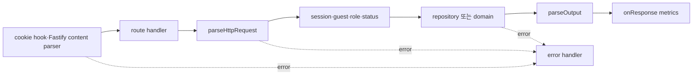
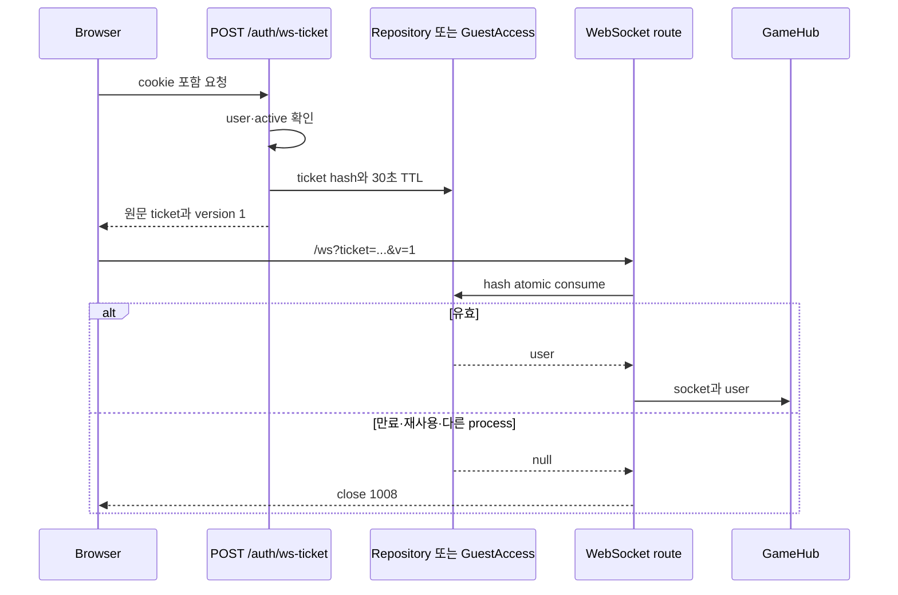

# 인증에서 실시간 연결까지

HTTP session, WebSocket ticket와 열린 connection은 같은 사용자를 가리키지만
수명과 저장 위치가 다르다. 이 문서는 Fastify request가 사용자를 찾는 지점부터
connection이 끊기거나 교체될 때까지의 신뢰 경계를 설명한다.

## Fastify 조립과 요청 수명

`apps/api/src/index.ts`가 환경을 읽고 repository를 만든 뒤 `buildApp`에 넘긴다.
Production은 `DATABASE_URL`이 없으면 시작을 거절하고, development·test·demo만
Memory repository를 선택할 수 있다. `buildApp`은 별도 dependency injection plugin을
등록하지 않고 closure에 repository, `GameHub`, metrics와 guest access를
보관한다.

전역 authentication hook은 없다. 각 handler가 `getCurrentUser`,
`requireRegistered`, `requireAdmin`, `isActive`를 필요한 조합으로 호출한다.
따라서 새 route를 추가할 때 hook이 자동으로 보호한다고 가정할 수 없다.

`parseHttpRequest`도 Fastify route schema가 아니라 handler의 첫 실행
단계다. Zod 오류는 400으로 바꾸지만 Fastify parser 오류나 raw repository
exception은 `ApiHttpError`가 아니어서 현재 500이 될 수 있다.

## 등록 session

`POST /auth/dev-login`은 development/test에서만 다음 상태를 만든다.

1. handle로 user를 만들거나 갱신한다.
2. 임의 session token을 만든다.
3. PostgreSQL이면 token, user ID와 14일 만료 시각을 `sessions`에 저장한다.
4. browser에 `pp_session` cookie를 설정한다.

Cookie helper는 host-only, path `/`, `HttpOnly`, `SameSite=Lax`를 사용하고
production/demo mode에서 `Secure`를 켠다. 그러나 `pp_session` 발급 route는
development/test에만 있어 실제 개발 session cookie는 `Secure:false`이며,
production에는 이 helper를 호출할 login route가 없다. Session token 자체는
cookie 서명값이 아니며 repository에서 존재와 만료를 조회한다.

PostgreSQL `getSessionUser`는 만료 시각을 검사하지만 만료 row를 즉시 삭제하지
않는다. Memory repository는 token→user mapping만 가지고 별도 만료가 없다.
같은 `AppRepository` interface가 같은 session 수명을 보장하지 않는 사례다.

development login은 admin bootstrap이 아니다. `admin` handle도 user role로
upsert하며 기존 admin을 일반 user로 바꿀 수 있다. 관리 role은 DB CLI의
`setUserRoleByHandle`이 별도로 설정한다. Browser admin session은 dev login으로
session을 먼저 만든 뒤 같은 handle의 role을 바꾸는 순서로 준비한다.
Memory API에는 실행 중 객체의 role을 바꾸는 공개 bootstrap이 없어
development+Memory admin 성공 경로는 없다.

production은 dev·guest login route를 모두 등록하지 않는다. 저장된 session을
읽는 코드는 있지만 새 운영 사용자가 session을 만드는 OAuth·password
provider는 없다. “session 인증 구현이 있다”와 “운영 login이 있다”를
구분해야 한다.

Demo는 단순히 dev login route만 닫는 mode가 아니다. `currentUser`를
guest-only로 호출하므로 `pp_guest`가 없으면 유효한 `pp_session`이 있어도
anonymous이고, 두 cookie가 함께 있으면 guest가 우선한다. WebSocket도 guest
ticket map만 소비하고 repository ticket은 시도하지 않는다. 따라서
demo+PostgreSQL 조합이 기존 등록 사용자 인증을 다시 여는 것은 아니다.

## guest session

demo의 `pp_guest`는 사용자 정보, 발급 IP와 2시간 만료 시각을 담은 payload와
HMAC 서명이다. payload는 암호화되지 않고 server session row도 없다.

`GuestAccess`가 process memory에 다음 상태를 소유한다.

- IP별 session 생성·request rate window
- hash를 key로 한 미사용 WebSocket ticket
- IP·user별 connection lease

게스트의 진행 중인 room과 2분짜리 recent result·만료 timer는 `GuestAccess`가
아니라 `GameHub`가 소유한다. 같은 API process 안에 있어도 cookie·rate limit
자원과 경기 복구 자원의 정리 주체는 다르다.

cookie 인증은 서명, 만료와 현재 request IP를 검사한다. 하지만 issue 시 ticket에
기록한 IP는 consume 함수가 새 request IP와 대조하지 않는다. connection 단계의
IP별 lease가 별도 상한을 적용할 뿐 ticket 자체가 IP에 묶였다고 설명하면
안 된다.

## route authorization

| 경계 | 현재 검사 | 남은 상태 |
| --- | --- | --- |
| `/auth/ws-ticket` | login과 active | logout은 미사용 ticket을 취소하지 않는다. ban 뒤 consume은 active 검사에서 ticket을 삭제하고 거절한다. |
| lobby chat·friend request·tournament write | registered와 active | raw domain 오류는 500이 될 수 있다. |
| `/me`, dashboard·`/profile/me`·friends 조회 | login/registered | banned session도 일부 조회한다. 공개 `/profile/:handle`은 login이 필요 없다. |
| profile update·friend accept | registered | active를 다시 확인하지 않는다. |
| admin route | login, active, role=admin | ban 성공 시 대상 queue·좌석·기존 socket을 폐기한다. session row 자체는 남는다. |
| room ready/input/pause/resume | connection과 실제 좌석 | `Client.user` status는 연결 때의 사본이다. |
| match chat | registered, UUID room, 실제 room 좌석 | 해당 room audience에만 저장·방송한다. |

HTTP route authorization과 domain ownership은 서로 대체하지 않는다. 친구
수락은 addressee, tournament match는 참가자, room command는 좌석을 별도로
검사해야 한다. Match chat은 shared shape, GameHub 좌석과 migration 006의 저장
불변식을 모두 통과해야 한다.

없는 자원과 권한 없는 자원을 항상 같은 404로 숨기는 일관된 정책은 없다.
demo에서 등록 사용자용 공개 자료는 404로 숨기지만 일반 authorization은
401·403을 사용하고 repository의 일부 not-found는 500이 된다.

## CSRF와 Origin

`HttpOnly`는 script가 cookie 원문을 읽는 것을 막고 `SameSite=Lax`는 일부
cross-site 요청에서 cookie 전송을 줄인다. 하지만 다음 장치는 없다.

- state-changing HTTP request의 CSRF token
- HTTP `Origin` 또는 `Referer` allowlist
- WebSocket upgrade의 `Origin` allowlist

CORS는 browser가 cross-origin response를 읽는 정책이고 application
authorization이 아니다. 허용 method 목록도 cookie를 이용한 부작용을
일반적으로 차단하지 않는다. SameSite의 site 경계와 origin 경계도 같지 않다.

WebSocket ticket은 session 원문을 URL에 넣지 않고 사용 시간·횟수를 줄이지만
허용된 origin에서 발급됐다는 증명은 아니다. 운영 배치가 같은 origin이어도
서버 trust boundary에는 이 부재를 남겨야 한다.

## session에서 ticket으로

registered ticket은 PostgreSQL 또는 Memory repository, guest ticket은
`GuestAccess` map에 있다. PostgreSQL consume은 delete와 user 반환을 한
statement에서 처리해 동시 두 connection 중 하나만 성공시킨다. hash만 저장해
DB 유출 시 원문 ticket 재사용 범위를 줄인다.

30초 TTL은 consume 가능한 시각만 제한한다. 29초에 인증된 socket을 30초에
닫지 않는다. 만료 ticket row를 주기적으로 지우는 cleanup job도 없다.

## 인증 전 frame과 connection 생성

WebSocket plugin은 upgrade 직후 ticket 조회가 끝나기 전에 message listener를
붙인다. 이때 connection별로 다음 상한을 둔다.

- transport frame 하나 8KiB(인증 뒤에도 동일)
- 최대 16개
- 합계 32KiB

인증 성공 뒤 buffered payload를 `GameHub.receive`에 넘긴다. 각 호출은 async지만
caller가 완료를 차례대로 await하지 않아 DB effect 완료 순서까지 frame 수신
순서와 같다고 보장할 수 없다.

인증 뒤 공통 message byte/rate 상한은 없다. `game.input`만 `InputGate`의
순번·token bucket을 거치고 chat·queue 등에는 같은 정책이 적용되지 않는다.

## 한 사용자와 connection 세대

`GameHub`는 connection ID map과 user ID→현재 connection map을 함께 가진다.
같은 사용자가 새 socket으로 연결하면 다음 순서로 교체한다.

1. 새 `Client`를 connection ID map과 user ID의 현재 값으로 먼저 등록한다.
2. 이전 heartbeat와 pending snapshot을 닫고 queue·tournament waiter,
   입력 gate와 이전 connection ID를 정리한다.
3. 이전 client가 room 좌석을 가졌다면 새 `Client` object로 옮긴다.
4. 이전 socket을 4001로 닫는다. 늦은 message·close callback은 current client
   검사를 통과하지 못한다.

브라우저 `GameSocketClient`도 generation number로 이전 ticket promise와 socket
callback을 폐기한다. server와 browser의 두 세대 검사가 함께 있어야 늦은
callback이 새 UI 상태를 덮지 않는다.

일반 network close는 교체와 다르다. server가 live connection map에서 client를
지운 뒤 room 좌석은 15초 보존한다. reconnect한 같은 user를 찾아 좌석과 최신
snapshot을 넘긴다.

## logout·ban과 열린 connection

일반 registered 흐름의 logout은 session row와 두 cookie를 지우지만 다음은
남을 수 있다.

- 이미 발급해 아직 유효한 30초 ticket
- 이미 인증된 WebSocket
- room 좌석과 `Client.user`의 role·status 사본

Demo에서 두 cookie가 함께 유효하면 현재 사용자를 guest로 해석해 등록 session
row를 삭제하지 않고 browser의 cookie 둘만 지운다. 등록 token row는 만료·별도
삭제까지 남을 수 있다.

ban transaction은 user status와 audit row를 바꾼 뒤 GameHub에 runtime revoke를
요청해 queue·room 좌석과 이미 열린 socket을 폐기한다. Session은 삭제하지 않고
미사용 ticket row도 transaction에서 함께 지우지는 않지만
consume query가 active user만 반환하므로 ticket을 삭제한 뒤 handshake를
거절한다. 일부 read HTTP route가 active를 확인하지 않는 경계는 별도로 남는다.

즉시 권한 철회를 구현하려면 session/ticket 폐기와 `GameHub` connection 종료,
route policy 통일을 함께 설계해야 한다. 현재 문서는 이 기능이 구현된 것처럼
표현하지 않는다.

## 실패와 검증 경계

| 실패 | 남는 상태 | 현재 확인 범위 |
| --- | --- | --- |
| session 없음·만료 | cookie가 browser에 남을 수 있음 | HTTP auth test |
| ticket 재사용·동시 consume | 첫 consume만 성공 | Memory·PostgreSQL ticket test |
| 인증 전 buffer 초과 | socket close 1009 | WS ticket test |
| 같은 user 재연결 | 이전 socket close 4001, room seat 이전 | GameHub reconnect test |
| logout 뒤 열린 socket | connection과 room command 가능 | logout 즉시 폐기는 별도 정책 없음 |
| ban 뒤 열린 socket | queue·좌석 정리와 socket 폐기 | admin·ticket·runtime revoke test |
| 잘못된 `Origin` | ticket이 유효하면 별도 거절 없음 | 직접 정책 test 없음 |
| malformed HTTP JSON | 500으로 변환될 수 있음 | 직접 status test 없음 |

인증 test가 통과해도 proxy log, external identity provider, CSRF와 production
session 발급까지 증명하지 않는다.
