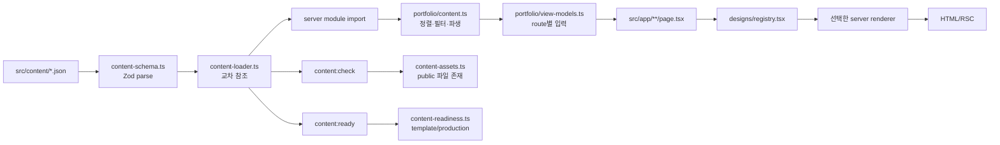

# 콘텐츠 원본에서 view model과 HTML까지

포트폴리오 콘텐츠는 14개 JSON에서 시작해 Zod parse와 파일 간 참조를 거친 뒤
렌더링 경로, asset 검사와 공개 준비 gate로 갈라진다. 다섯 renderer는 정규화된
route view model을 서로 다른 HTML로 표현한다. 이 문서는 현재 데이터의 소유자,
수명, 실패와 타입 경계를 연결한다. 편집 절차는
[콘텐츠 편집 문서](../docs/content-pipeline.md), 디자인별
표현은 [다섯 renderer 계약](./five-design-renderers-and-interface-contracts.md),
변화 과정은 [01](../devlog/01-content-contract-and-selectors.md),
[06](../devlog/06-runtime-content-boundaries.md),
[12](../devlog/12-route-view-models.md)에서 다룬다.

## 전체 흐름



검사와 렌더링은 같은 함수를 공유하지만 진입 시점이 하나는 아니다.

- `content:check`는 loader와 asset validator를 직접 실행한다.
- `content:ready`와 `prebuild`는 mode에 맞는 공개 준비 상태를 확인한다.
- server module이 `portfolioSource`를 import하면 loader가 module 적재 중
  실행된다.
- page request는 이미 module 수명에 적재된 canonical content에서 route view
  model을 새로 만든다.

따라서 구조 오류는 checker와 build뿐 아니라 server module 시작을 막을 수 있다.
반면 production placeholder의 전체 순회는 `content:ready`가 수행하고 build
때는 `prebuild`가 이 script를 호출한다. request-time code는 mode와
`SITE_URL`을 다시 해석할 뿐 모든 readiness 조건을 재검사하지 않는다.

## 원본 14개와 콘텐츠 모델

| 파일 | 모델과 nullable/optional 값 | 소비 경계 |
| --- | --- | --- |
| `site.json` | site identity, optional social image와 page map, navigation/footer | layout, shell, metadata, sitemap |
| `profile.json` | profile, optional `photo` | 모든 home/shell, structured data |
| `projects.json` | group/metric/project, optional enabled/featured/flags | home, index, detail, resume, journey |
| `presentation.json` | design ID, section order, UI copy, terminal | 다섯 renderer |
| `skills.json` | focus/group | home/about |
| `tech-stack.json` | stack ID, icon, color | home/detail |
| `experience.json` | period/title/body | about/resume |
| `journey.json` | nullable `endDate`, `projectId`, `sourcePath` | home/journey |
| `journey-narrative.json` | milestone와 anchor project ID | journey |
| `interview-map.json` | track/item/answer project ID | interview-map |
| `curation.json` | category와 project ID | about |
| `links.json` | optional ID, enabled/external/placements | hero/contact/footer/project |
| `contact.json` | 연락 문구와 선호 방법 | home/contact |
| `resume.json` | nullable `downloadUrl`, project ID | resume |

optional은 속성이 없을 수 있음을, nullable은 속성은 있지만 현재 값이 없음을
표현한다. 예를 들어 profile photo는 객체 자체가 optional이고 resume
`downloadUrl`은 `string | null`이다. renderer는 이 차이에 맞춰 조건부
렌더링한다.

remote API, database나 사용자별 server state는 없다. JSON은 build context에
포함된 정적 입력이므로 배포된 산출물의 콘텐츠를 바꾸려면 다시 build해야 한다.
개발 서버에서는 source 변경을 감지해 module을 다시 compile할 수 있다.

## TypeScript의 정적 계약

`tsconfig.json`은 `strict`, `noEmit`, bundler module resolution,
`resolveJsonModule`, isolated module과 `@/*` alias를 사용한다. TypeScript는
다음 경계를 compile 전에 검사한다.

- page의 `params: Promise<{ projectId: string }>`와 `searchParams`
- component props와 `children: React.ReactNode`
- nullable/optional 값의 조건부 사용
- `SiteDesignId`, deployment status와 route ID 같은 union
- `PortfolioRouteViewModel`의 `route` discriminated union
- module import/export와 public barrel

정적 타입은 JSON의 runtime 문자열, environment variable과 URL 도달성을
검사하지 않는다. 다음 코드는 TypeScript에게 원본이 `SiteContent`라고
주장할 뿐 값을 검사하지 않는다.

```ts
// 현재 src/lib/portfolio/content.ts
const site = portfolioSource.site as SiteContent;
const profile = portfolioSource.profile as ProfileContent;
const presentationSource =
  portfolioSource.presentation as unknown as PresentationContent;
```

현재 타입은 schema에서 모두 자동 파생되지 않는다.

- `ProjectGroup`, `ProjectMetric`, project source와 presentation source 일부는
  `z.infer`에서 파생한다.
- `SiteContent`, `ProfileContent`, `ContentLink`, `PortfolioProject`,
  journey/resume/contact 등은 `portfolio/types.ts`에 수기로 선언한다.
- 정규화 결과는 source schema에 없는 `category` 같은 필드를 추가하므로 별도
  domain 타입이 필요하다.
- `as`와 이중 단언이 남아 있어 schema와 수기 타입 drift를 compiler가 가릴
  가능성이 있다.

design ID도 schema, `SiteDesignId`, loader의 지원 목록, `designs/config.ts`,
registry와 E2E 행렬에 중복된다. route ID 역시 타입, page, renderer와 test에
반복된다. test가 현재 조합을 확인하지만 단일 source에서 완전히 파생되는 구조는
아니다.

## Zod와 loader의 runtime 계약

`src/lib/content-schema.ts`는 대부분의 객체를 strict로 두고 non-empty string,
ID pattern, hex color, enum/union, optional/nullable와 배열 구조를 검사한다.
다만 `site`와 `presentation`의 일부 확장 지점은 `.passthrough()`라 unknown
field를 보존한다. parse에 실패하면 파일명과 JSON path를 포함한 issue를 만들고
해당 파일의 값을 반환하지 않는다.

모든 파일 parse가 끝난 뒤 `src/lib/content-loader.ts`가 다음 관계를 검사한다.

- project group ID/order, project metric ID, project ID/order
- technology/link/milestone/interview track/curation category/design ID 중복
- navigation href와 각 project의 tag/stack reference 중복
- project → group/stack
- resume/journey/narrative/interview/curation → project
- contact → link
- default design과 지원하는 다섯 design
- 내부 route와 활성 page/project

비활성 값을 가리키는 내부 link나 navigation도 오류다. 화면에서 숨기는 것과
참조 무결성을 끊는 것을 같은 동작으로 취급하지 않는다. 관계 문제가 있으면
issue를 모아 `PortfolioContentError`를 던지고 부분 `PortfolioSource`를
반환하지 않는다.

이 오류 수집에는 percent encoding 예외가 있다. `/projects/%`처럼 schema의
root-relative prefix 검사를 통과한 값은 project ID를 해석하는
`decodeURIComponent()`에서 raw `URIError`를 일으킬 수 있다. 이 예외는
`ContentValidationIssue`로 변환되지 않으므로 다른 관계 오류와 함께 수집되지
않는다.

schema의 존재가 의미 검증의 완결을 뜻하지는 않는다.

- `contentHrefSchema`는 허용 scheme의 접두사를 확인하므로 `https://`처럼
  실제 `URL` parse가 안 되는 문자열도 통과할 수 있다.
- 내부 project route의 잘못된 percent encoding은 `PortfolioContentError`가
  아니라 raw `URIError`로 중단될 수 있다.
- journey date는 non-empty string이며 달력 형식을 검사하지 않는다.
- Classic terminal `commands`는 배열 최소 길이가 없다.
- `external` flag와 URL scheme의 일관성을 검사하지 않는다.

이 한계는 [실패 복구 절차](../docs/content-pipeline.md)에 수정 시 확인할 반례로
정리한다.

## asset 경계

`contentAssetPathSchema`는 `/template/` 또는 `/content/`로 시작하는
root-relative URL만 허용한다. `validatePortfolioAssets()`는 public root와
결합한 뒤 정규화 결과가 밖으로 탈출하지 않는지, 파일이 존재하는지 확인한다.

소유권은 다음처럼 나뉜다.

- JSON은 browser가 요청할 URL 문자열을 소유한다.
- repository의 `public/`은 원본 file을 소유한다.
- Next/Docker 배포물은 그 file을 runtime server에 포함할 책임을 가진다.
- renderer는 alt와 표시 크기/비율을 소유한다.

파일 존재 검사는 image decode, pixel 크기, MIME, PDF 유효성이나 HTTP response를
확인하지 않는다. Dockerfile은 `public/`을 복사하고 container gate가 tracked
asset의 실제 응답과 MIME을 별도로 확인한다.

Design·Classic의 일반 ``는 CSS 비율로 공간을 만들지만 responsive
`srcset`은 없다. Editorial은 `next/image` width/height, Brutalist와 Cinematic은
크기를 소유하는 container 안에서 `fill`과 `sizes`를 사용한다. 같은 URL이
디자인마다 다른 최적화 경로로 흐른다.

## 정규화와 source of truth

`src/lib/portfolio/content.ts`는 module 상단에서 loader 결과를 domain 값으로
바꾼다.

```ts
// 현재 소스에서 축약
const projectGroups = portfolioSource.projects.groups
  .slice()
  .sort((left, right) => left.order - right.order);

const projects = portfolioSource.projects.items.map((project) => ({
  ...project,
  category: projectGroupById.get(project.groupId)?.label ?? project.groupId,
}));
```

정규화는 다음을 수행한다.

- group을 `order`로 정렬한다.
- project에 group label에서 얻은 `category`를 붙인다.
- journey를 date 문자열, 동률이면 title 문자열 순으로 정렬한다.
- `getPortfolioContent()` 호출마다 disabled project와 link를 제외한다.
- project link 배열을 새로 만든다.

journey 정렬은 날짜 의미가 아니라 lexical comparison이다. 날짜 schema가
형식을 제한하지 않으므로 형식이 섞이면 예상 시간 순서와 다를 수 있다.

`presentation.pages.projects.groups`는 schema상 존재하지만 실행 중 다음 값으로
덮어쓴다.

```ts
groups: projectGroups.map((group) => ({
  category: group.label,
  body: group.description,
}))
```

따라서 project index group의 실제 source of truth는 `projects.json`이다.
presentation 쪽 group 문구만 수정해도 화면에 반영되지 않는다.

## canonical 객체의 소유권과 수명

`portfolioSource`, `site`, `profile`, `portfolioPresentation`, journey와 여러
`Map`은 server process의 module instance가 소유한다. JSON을 request마다 다시
읽지 않으며 module cache 수명 동안 공유된다.

`getPortfolioContent()`는 호출마다 새 최상위 envelope와 project object,
project link 배열, global link 배열을 만든다. 그러나 deep clone은 아니다.
site/profile/presentation, project의 screenshot·architecture·tags 같은 nested
객체와 배열은 module-level 값을 공유한다.

```text
server module 수명
└─ canonical site/profile/presentation/projects
   ├─ request A의 얕은 envelope ─┐
   └─ request B의 얕은 envelope ─┴─ 같은 nested 객체를 참조할 수 있음
```

타입은 deep readonly가 아니고 `Object.freeze()`도 사용하지 않는다. 현재
selector와 renderer는 읽기만 하므로 정상 경로에서는 누출이 없다. 새 코드가
nested 배열을 `sort()`하거나 값을 mutate하면 다음 request가 바뀐 상태를 볼 수
있다. 공유 콘텐츠는 불변으로 취급하고, 변경이 필요한 파생 값은 복사해서 만든다.

`getPortfolioContent()`의 `_legacyEnvironment` 인자는 즉시 무시된다. 실행
environment가 project link나 dashboard URL을 바꾸는 소유자가 아니다.

## selector와 URL 상태

`portfolio/selectors.ts`는 여러 route가 공유하는 순수 계산을 둔다.

- link placement와 preferred contact
- project detail link와 deployment/live 조건
- metric filter와 집계
- enabled page
- design/debug query와 내부 href

`view`와 `debug=content` 상태는 URL이 소유한다. renderer가 전역 React store를
갖지 않는다. `getTemplateHref()`와 `createTemplateHref()`는 current path에
design과 debug 상태를 붙이고, default Editorial은 불필요한 `view`를 생략한다.
브라우저 back/forward와 공유 URL이 같은 상태를 복원할 수 있다.

## route view model

`portfolio/view-models.ts`는 모든 route가 공통으로 읽는 `site`, `profile`,
`presentation`, `footerLinks`와 route별 값만 합친다.

```ts
// 현재 타입에서 축약
export type PortfolioRouteViewModel =
  | HomeViewModel
  | ProjectIndexViewModel
  | ProjectDetailViewModel
  | AboutViewModel
  | ResumeViewModel
  | ContactViewModel
  | JourneyViewModel
  | InterviewMapViewModel;
```

대표 파생 값은 다음과 같다.

- home: featured/fallback project, lead, metric values, 최근 journey, contact
- projects: configured/unconfigured group과 archive group
- detail: project, detail link, stack item, representative와 다른 image
- about: curation category에 project object 연결
- resume: project ID를 project object로 연결
- contact: preferred/contact fallback link
- journey: milestone와 timeline project 연결
- interview map: answer의 project 연결

renderer는 project ID를 다시 찾거나 metric filter를 재해석하지 않는다.
상세 ID가 없으면 creator가 `null`을 반환하고 App Router page가 `notFound()`를
호출한다.

`RouteViewModel` generic은 route에 없는 `PortfolioContent` key를 `never`로
표시하지만 creator return에 단언이 남아 있다. registry 앞의
`DesignRouteRequestProps`는 route와 view model을 discriminated union으로
묶는다. registry가 만드는 `DesignRouteProps`는 이 관계가 느슨해지고 일부
renderer가 다시 cast한다. 새 field나 route를 추가할 때 typecheck만으로
runtime 소비 일치를 모두 증명하지 못하므로 view-model unit test와 다섯
renderer 행렬을 함께 본다.

## renderer와 최종 HTML

App Router page가 route view model을 만든 뒤 `renderDesignRoute()`에 넘긴다.
registry는 design ID의 module을 dynamic import하고 Server Component
renderer를 호출한다. 다섯 표현의 shell·route 구조는
[별도 architecture](./five-design-renderers-and-interface-contracts.md)에
코드로 비교한다.

정상 경로에서 HTML은 서버에서 생성되고 콘텐츠의 대부분은 hydration 없이
보인다. Classic home의 `AnimatedTerminal`과 design switcher의 close button만
first-party Client Component로 hydration된다. `next/link`와 `next/image`의
framework runtime 경계는 별도로 들어간다.

## production gate와 배포 입력

`content-readiness.ts`는 다음 discriminated union을 반환한다.

```ts
type PortfolioReadinessResult =
  | { mode: "template"; siteUrl: undefined }
  | { mode: "production"; siteUrl: URL };
```

template은 placeholder를 허용하고 검색 비색인 출력을 선택한다. production은
`SITE_URL`, `/content/` asset, 실제 profile/project/contact 입력을 요구하며
모든 issue를 모아 `PortfolioReadinessError`로 실패한다.

placeholder marker는 heuristic이라 false positive와 false negative가 가능하다.
project/contact URL 검사는 실제 도달성과 localhost·사설망 전체를 막지 않는다.
readiness는 공개 입력의 최소 정적 gate이지 콘텐츠 품질이나 운영 가용성
검사자가 아니다.

`prebuild`의 readiness와 request-time mode 해석은 원자적이지 않다.
template로 build하고 runtime만 production으로 바꾸면 전체 readiness 없이
production 검색 출력 경로가 열릴 수 있다. production으로 build한 Docker
builder의 env는 새 runner stage에 자동 상속되지 않아 runtime이 template로
돌아갈 수도 있다. metadata route cache까지 포함한 배포 실패는
[품질 gate architecture](./production-readiness-and-quality-gates.md)에서
설명한다.

## 경계별 실패와 검증

| 경계 | 실패 결과 | 검증 |
| --- | --- | --- |
| Zod parse | file/path issue, source 미반환, module/build 중단 가능 | schema/loader unit test, `content:check` |
| 교차 참조 | issue 일괄 보고, 부분 source 없음 | loader test |
| asset 존재 | repository 경로 오류, check 중단 | asset test, `content:check` |
| 정규화 | 모든 design에 같은 잘못된 파생 값 전파 | selector/content unit test |
| view model | 한 route 또는 여러 design에 필드 누락 | view-model test, renderer 행렬 |
| renderer | 특정 design/route의 markup·접근성 회귀 | route render test, Playwright/axe/visual |
| readiness | production build 전 issue 일괄 보고 | readiness test, `content:ready` |
| container 조립 | HTML 또는 asset runtime 누락 | `build:verify`, `test:container` |

unit test는 browser layout을 증명하지 않는다. Playwright는 모든 browser와
보조기기 조합을 증명하지 않는다. 저장된 baseline은 이전 실행 기록이므로 이번
checkout의 통과를 대신하지 않는다.
