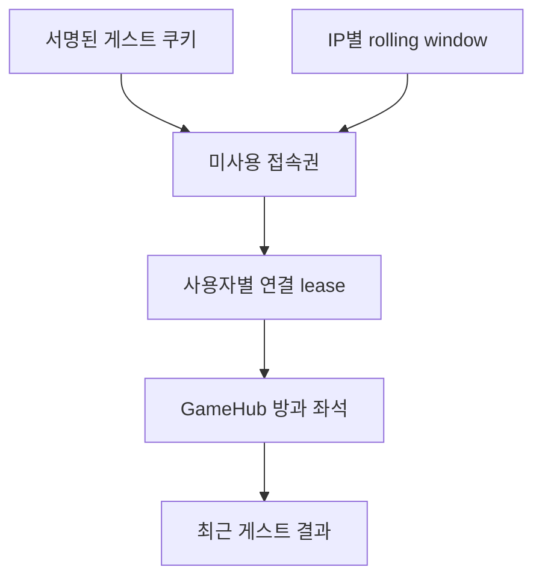

# 게스트 데모의 격리와 자원 상한

게스트는 등록 사용자의 축약판이 아니다. 로그인 상태는 사용자·IP·만료 시각을
담은 서명 쿠키로 확인하고, 접속권·연결 점유권·경기 상태는 API 프로세스가
관리한다. 쿠키 인증과 실시간 복구가 서로 다른 수명을 가진다는 점을 데모 운영의
전제로 삼아야 한다.

## 실행 모드 경계

`GuestAccess`는 `APP_MODE=demo`일 때만 생성되고 `POST /auth/guest`도 이 모드에서만 등록된다. demo의 `currentUser`는 게스트 쿠키만 확인하므로 같은 프로세스에 PostgreSQL 저장소가 있어도 등록 사용자 세션으로 전환되지 않는다.

게스트에게 허용되는 경로는 다음과 같다.

- 게스트 세션 생성과 로그아웃
- 새 WebSocket 접속권 발급
- 로비의 현재 접속·방 통계 조회
- 게스트끼리의 매칭 또는 즉시 AI 경기
- 경기 입력, 준비, 일시정지, 재개

채팅과 토너먼트 WebSocket 이벤트는 `GameHub.receive`에서 거절한다. HTTP의 등록 사용자 전용 경로도 `requireRegistered` 또는 demo 모드 분기로 막는다. 이 검사는 화면 표시와 별개이므로 브라우저 요청을 직접 만들어도 같은 결과가 나야 한다.

## 서명 쿠키가 담는 것

`pp_guest`는 다음 payload를 base64url로 인코딩하고 HMAC 서명을 붙인 값이다.

- 계약 버전
- 임의로 만든 게스트 사용자
- 세션을 만든 요청의 IP
- 만료 시각

서명은 위변조를 탐지하지만 내용을 숨기지 않는다. 이메일, 권한 비밀, 서버 내부 식별자를 추가해서는 안 된다. 인증 시에는 서명, payload 버전, `sessionKind`, role, status, 만료 시각과 요청 IP를 다시 확인한다.

`SESSION_SECRET`은 demo에서 최소 길이를 만족해야 한다. 값을 바꾸면 기존 쿠키를
모두 검증할 수 없게 된다. 반대로 여러 인스턴스가 같은 secret을 쓰고
`request.ip`도 같게 계산하면 별도 서버 세션 저장소 없이 어느 인스턴스에서든
쿠키 인증 자체는 이어진다.

## IP를 신뢰하기 위한 전제

쿠키의 IP 결박, 세션 생성 빈도, 접속권 발급 빈도와 동시 연결 상한은 모두 Fastify의 `request.ip`를 사용한다. Compose에서는 Caddy 뒤 API에 `TRUST_PROXY=1`을 전달한다.

직접 인터넷에 노출한 API에서 임의의 전달 헤더를 신뢰하면 사용자가 제한 키를 바꿀 수 있다. 반대로 신뢰할 프록시가 있는데 proxy 설정을 끄면 모든 사용자가 프록시 주소로 묶일 수 있다. 배포 전에 다음 두 가지를 같이 고정해야 한다.

1. API에 직접 접근할 수 있는 네트워크를 차단한다.
2. 실제 프록시 홉 수와 전달 헤더 정책에 맞춰 `trustProxy` 범위를 정한다.

현재 설정은 boolean 값이라 프록시 체인을 세밀하게 제한하지 않는다.

## 프로세스 메모리에 남는 상태

쿠키는 브라우저가 보관하고 서버는 요청마다 payload와 서명을 검증한다. 생성 후
2시간 동안 유효하며, 같은 `SESSION_SECRET`과 IP 조건을 만족하면 API 재시작이나
다른 인스턴스에서도 새 게스트 세션을 만들 필요가 없다.

프로세스에 귀속되는 것은 IP별 rate-limit window, 미사용 접속권, 연결 lease,
방과 최근 결과다. 재시작하거나 다른 인스턴스로 이동하면 이 상태는 사라진다.
따라서 쿠키로 새 접속권을 발급받을 수는 있어도 진행 중인 방이나 최근 결과를
복구할 수는 없다. 최근 종료 결과의 보관 시간은 2분이다.

## 세션 생성과 접속권 상한

기본 정책은 다음 자원을 서로 따로 제한한다.

| 자원 | 기본 상한 | 정리 계기 |
| --- | --- | --- |
| IP별 게스트 생성 | 분당 10회 | rolling window timer |
| 추적하는 IP | 10,000개 | 마지막 window 만료 |
| IP별 미사용 접속권 | 4개 | 소비·만료·교체 |
| 전체 미사용 게스트 접속권 | 400개 | 소비·만료·교체 |
| IP별 접속권 발급 | 분당 30회 | rolling window timer |
| IP별 열린 게스트 연결 | 4개 | WebSocket close |
| 전체 열린 게스트 연결 | 200개 | WebSocket close |

상한 값은 `GuestAccess` 생성 옵션으로 바꿀 수 있지만 환경 변수로 직접 노출돼 있지는 않다. 정책을 조정하려면 코드와 테스트를 함께 바꿔야 한다.

게스트별 미사용 접속권은 하나만 유지한다. 새 접속권을 발급하면 이전 해시와 역방향 색인을 지운 뒤 새 값을 저장한다. 다만 교체된 이전 접속권의 cleanup timer는 취소하지 않아 만료 시각까지 no-op callback으로 남는다. 접속권을 실제로 소비할 때는 timer와 역방향 색인을 함께 비운다.

접속권을 발급할 때 IP를 함께 기록하지만 `consumeWsTicket`은 연결 request IP를
인자로 받지 않아 같은 IP인지 비교하지 않는다. guest cookie 인증은 IP에
결박되지만 발급이 끝난 원문 ticket 자체는 그렇지 않다. 연결 단계에서 적용하는
IP별 lease 상한과 ticket의 신원 검증을 같은 장치로 설명하면 안 된다.

## 연결 lease가 늦은 close를 막는 방식

게스트 연결 수는 사용자 ID별 lease로 센다. 같은 게스트가 새 소켓을 열면 새 lease ID로 기존 값을 교체한다. 이전 소켓의 close callback이 늦게 실행돼도 자신이 가진 lease ID가 현재 값과 같을 때만 삭제한다.

이 장치는 연결 수가 잘못 줄어드는 것을 막는다. 방 좌석 교체는 별도로 `GameHub.clientsByUser`와 `replaceConnection`이 담당한다. 두 자료구조가 같은 사용자 ID를 사용하지만 한쪽이 다른 쪽의 수명을 자동으로 보장하지는 않는다.

## 매칭과 결과 격리

`Matchmaker`는 참가자를 `registered`와 `guest`로 구분하고 같은 종류끼리만
짝짓는다. 게스트가 `mode:"ai"`를 선택하면 즉시, queue에서 6초 기다리면
fallback으로 process-local AI를 사용한다. 어느 경로도 DB의 NPC를 읽지 않는다.
반면 등록 queue fallback은 가장 가까운 DB NPC를 선택하므로 같은 AI 화면이라도
상대 자료의 소유자가 다르다.

게스트 방은 등록 경기와 같은 시뮬레이션·스냅샷·재접속 코드를 사용한다. 종료 시에는 `MatchResultRepository.finalizeMatch`를 호출하지 않고 `persisted: false`, `matchId: null`인 결과 이벤트를 보낸다. 레이팅 변화도 기록하지 않는다.

연결이 결과 이벤트 직전에 끊길 수 있으므로 `GameHub`는 게스트 ID별 최근 결과를 잠시 보관한다. 다시 연결하면 현재 방을 먼저 복구하고, 복구할 방이 없을 때 최근 결과를 보낸다. 이 메모리는 만료 timer, 새 결과, `GameHub.close`에서 정리된다.

## 실패와 정리 순서

| 상황 | 남는 상태 |
| --- | --- |
| 잘못된 쿠키 또는 다른 IP | 인증 실패, 서버 상태 생성 없음 |
| 접속권 발급 상한 초과 | 기존 세션 유지, 새 ticket 없음 |
| 연결 상한 초과 | ticket은 이미 소비되고 WebSocket은 정책 위반으로 종료 |
| 새 소켓으로 사용자 연결 교체 | 새 lease와 새 `Client` 유지 |
| 경기 중 연결 종료 | lease 해제, 방 좌석은 재접속 기한까지 보존 |
| 경기 종료 | 방 제거, 최근 결과만 임시 유지 |
| API 종료 | 쿠키는 남지만 rate-limit window·ticket·lease·방·최근 결과 소멸 |

접속권은 연결 상한을 확인하기 전에 소비된다. 상한 때문에 거절된 클라이언트가 같은 값을 다시 쓸 수 없다는 점을 재시도 코드에서 고려해야 한다.

`GuestAccess`에는 명시적인 `close()`가 없다. 자신이 만든 window·ticket timer는
`unref`라 process 종료를 막지는 않지만 app close 순간 모두 취소되는 것은
아니다. `GameHub.close`는 자신이 소유한 recent result timer와 room을
정리하지만 guest access 내부 timer 수명은 각 만료 callback까지 남는다.

## 확인할 테스트

- `apps/api/src/guestAccess.test.ts`: 쿠키 위변조·IP·만료·각 상한과 timer 정리
- `apps/api/src/guest-demo.test.ts`: demo 전용 HTTP와 한 번 쓰는 접속권
- `apps/api/src/gameHub.guest.test.ts`: 등록 사용자와의 매칭 분리, 비영속 결과, 최근 결과
- `tests/e2e/guest-demo.spec.ts`: 실제 브라우저 로그인, PvP·AI 경기, 재연결

단위 테스트의 작은 상한으로 자료구조 정리는 확인하지만 기본 최대치에서의
메모리 사용량과 장시간 timer 비용은 확인하지 않는다. 다중 인스턴스에서도 쿠키
인증은 같은 secret과 IP 조건으로 유지할 수 있다. rate limit, 미사용 접속권,
동시 연결 수와 방 복구까지 일관되게 만들려면 공유 상태의 원자성과 인스턴스
이동 정책을 별도로 정해야 한다.
