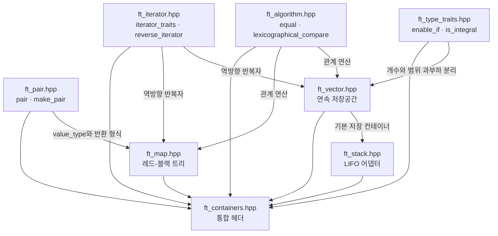
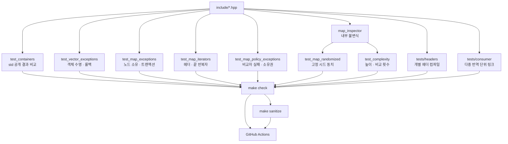

# 공용 도구에서 세 컨테이너까지 이어지는 의존 관계

C++ 문법 연습에서는 템플릿 하나가 컴파일되는지만 봐도 충분한 경우가 많았다.
컨테이너에서는 작은 공용 도구의 조건 하나가 여러 공개 API로 번진다. 이 지도는
파일이 만들어진 순서보다 `enable_if`, `pair`, 반복자와 비교 알고리즘의 계약이
`vector`, `stack`, `map`과 각 검사로 어떻게 이어지는지 보여 준다.

## 구현 그래프



`vector`와 `map`은 공용 도구를 함께 쓰지만 서로의 구현에 의존하지 않는다. `vector`의 재할당 결함이 `map`의 회전으로 전파되거나, `map`의 색 보정이 `vector`의 객체 수명에 영향을 주지는 않는다. `stack`은 기본 저장 컨테이너로 `vector`를 사용하므로 값 저장, 예외와 관계 연산의 성질을 위임받는다.

## 공용 도구가 잘못됐을 때 번지는 곳

| 구성 요소 | 상위 사용처 | 잘못됐을 때 나타나는 영향 |
|---|---|---|
| `enable_if`, `is_integral` | `vector`의 범위 생성·대입·삽입 | 정수 개수와 반복자 범위 과부하를 잘못 선택할 수 있다. |
| `pair`, `make_pair` | `map::value_type`, 삽입 결과, `equal_range` | 키·값 묶음과 반환 형식이 함께 영향을 받는다. |
| `equal` | `vector`, `map`의 `==` | 두 컨테이너의 원소열 동등 비교가 함께 틀릴 수 있다. |
| `lexicographical_compare` | `vector`, `map`의 순서 관계 | 기본 `vector`를 쓰는 `stack`의 관계 연산에도 전파된다. |
| `iterator_traits`, `reverse_iterator` | `vector`, `map`의 역방향 순회 | 서로 다른 저장 표현의 역방향 인터페이스가 동시에 영향을 받는다. |

`map`의 정방향 반복자는 노드의 부모·자식 링크를 직접 따라간다. 공용 `reverse_iterator`는 그 양방향 반복자를 감쌀 뿐 트리 구조를 알지 못한다. 반대로 `vector` 반복자는 포인터이므로 같은 어댑터를 쓰더라도 무효화 규칙은 전혀 다르다.

## 컨테이너 내부 의존

### `vector`

`vector`는 할당자가 저장공간을 획득한 뒤 필요한 슬롯에만 객체를 생성한다. 생성된 객체 수를 `_size`에 반영하고, 재할당 경로에서는 새 블록 전체를 완성한 뒤 기존 블록을 교체한다.

범위 과부하는 타입 도구에, 역방향 순회는 반복자 도구에, 관계 연산은 공용 알고리즘에 의존한다. 예외 안전성은 이 공용 도구보다 `construct`·`destroy`의 순서와 임시 저장 상태에 달려 있다.

### `stack`

`stack`은 `back`, `push_back`, `pop_back`, `size`, `empty`를 하위 컨테이너에 전달한다. 기본 형식에서는 `ft::vector<T>`가 이 요구를 충족한다. 따라서 `vector`의 값 수명과 대입 실패 특성은 `stack`에도 이어지지만, `stack`은 반복자를 노출하지 않는다.

### `map`

`map`은 다음 구성 요소를 함께 사용한다.

- `ft::pair<const Key, T>`를 값 형식으로 사용한다.
- 삽입과 범위 질의 결과도 `ft::pair`로 반환한다.
- 자체 노드 반복자를 공용 `reverse_iterator`로 감싼다.
- 관계 연산을 `equal`과 `lexicographical_compare`에 맡긴다.
- 값 할당자를 `node` 형식의 할당자로 재결합한다.

트리 자체는 값이 없는 헤더, 값 노드, 비교자와 색·회전 코드로 구성된다. 헤더 센티널은 공용 반복자 도구가 아니라 `map`의 자체 표현이다.

현재 `map`은 값 할당자 상태에서 노드 할당자를 구성하고 레드-블랙 색·회전·보정을
같은 파일에 둔다. 전자는 할당 블록의 소유 관계에, 후자는 높이와 정렬 구조에
영향을 주므로 각각 예외 검사와 구조·복잡도 검사로 확인해야 한다.

## 공개 진입점

[`include/ft_containers.hpp`](../include/ft_containers.hpp)는 다음 헤더를 한 번에 포함한다.

```cpp
# include "ft_algorithm.hpp"
# include "ft_iterator.hpp"
# include "ft_map.hpp"
# include "ft_pair.hpp"
# include "ft_stack.hpp"
# include "ft_type_traits.hpp"
# include "ft_vector.hpp"
```

소비자는 통합 헤더를 쓰거나 필요한 개별 헤더를 직접 포함할 수 있다. [`tests/headers`](../tests/headers)는 모든 공개 헤더를 각각 첫 번째 포함 파일로 사용해 두 번째 경로를 컴파일한다.

## 검증 그래프



[`tests/test_containers.cpp`](../tests/test_containers.cpp)는 통합 헤더 하나를 포함해 공용 도구와 컨테이너의 선택된 공개 결과를 비교한다. 이 검사만으로는 객체 수명, 색, 부모 링크나 비교 횟수를 알 수 없으므로 검증을 별도 실행 파일로 나눈다.

| 검사 | 사용하는 구현 | 추가로 관찰하는 상태 |
|---|---|---|
| `test_vector_exceptions` | `ft_vector.hpp` | 살아 있는 객체 주소, 복사·대입 실패 위치, 할당 블록 |
| `test_map_exceptions` | `ft_map.hpp` | 비교자·할당 실패 위치, 대상 원소, 노드 블록 |
| `test_map_iterators` | `ft_map.hpp` | 저장한 끝 반복자, 회전·삭제·교환 뒤 순회 |
| `test_map_policy_exceptions` | `ft_map.hpp` | 비교자 대입 실패 뒤 tree 소유권과 계속 사용 가능성 |
| `test_map_randomized` | `ft_map.hpp`, `map_inspector.hpp` | `std::map` 결과와 내부 레드-블랙 조건 |
| `test_complexity` | `ft_map.hpp`, `map_inspector.hpp` | 실제 높이와 비교자 호출 횟수 |

`map_inspector`는 `ft::detail`의 친구 선언을 통해 테스트에서만 내부 링크를 읽는다. 실행 경로에 검사 분기를 넣지 않고 공개 결과와 내부 조건을 같은 단계에서 확인한다.

## 소비자 검증

개별 헤더 검사는 각 `.hpp`가 다른 프로젝트 헤더의 우연한 선행 포함에 기대지 않는지 확인한다. 각 소스는 `-c`로 컴파일하며 링크하거나 실행하지 않는다.

다중 번역 단위 검사는 `vector_consumer.cpp`, `map_consumer.cpp`, `main.cpp`를 따로 컴파일해 하나의 실행 파일로 링크한다. 헤더 전용 정의의 링크 중복과 실제 소비자 호출 경로를 함께 확인한다.

## Make가 보는 의존과 코드가 가진 의존은 다르다

Makefile은 각 검사 실행 파일이 모든 `include/*.hpp`와 `tests/support/*.hpp`에 의존하도록 보수적으로 구성한다. 특정 검사에서 사용하지 않는 헤더가 바뀌어도 실행 파일을 다시 컴파일한다. 누락된 재빌드를 피하기 위한 선택이며, 모든 헤더가 의미상 서로 의존한다는 뜻은 아니다.

헤더 단독 검사와 소비자 객체도 모든 공개 헤더를 선행 조건으로 둔다. 저장소 규모에서는 단순하고 안전하지만, 정밀한 컴파일러 의존 파일을 생성하는 빌드보다 재컴파일 범위가 넓다.

검증 실패를 좁힐 때는 구현 그래프와 검사 그래프를 함께 봐야 한다. 값 결과는
`test_containers.cpp`, 객체와 노드 수명은 예외 검사, 내부 균형은 무작위·복잡도
검사, 공개 포함 경계는 header와 consumer 검사가 맡는다. 같은 헤더를 읽는다는
이유만으로 같은 성질을 증명하는 검사는 아니다.
