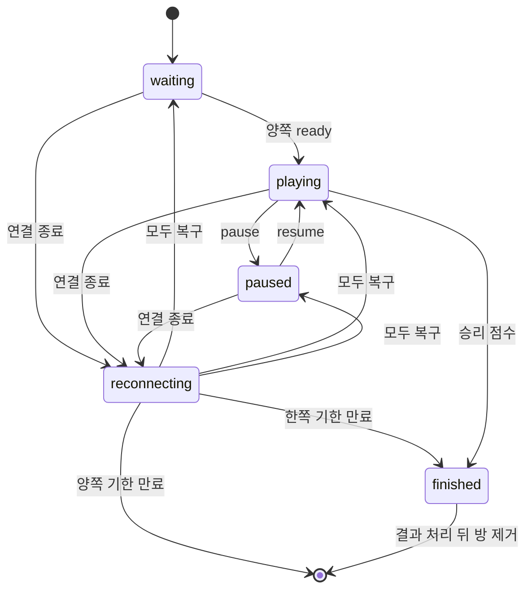

# 매칭, 방, 재접속의 수명

`GameHub`는 열린 연결을 경기 자원으로 바꾸는 조정자다. 대기열, 방, 재접속 timer, 결과 확정 순서를 한곳에서 연결하지만 각 정책과 상태 계산은 작은 객체에 맡긴다. 장애를 고칠 때는 소켓 존재 여부와 방 좌석 존재 여부를 같은 것으로 취급하지 않는 것이 중요하다.

## 책임 분리

| 구성요소 | 책임 |
| --- | --- |
| `GameHub` | `Client` 등록, 이벤트 분배, 방 생성·폐기, 저장소 호출 |
| `Matchmaker` | 중복 참가 방지, 사용자 종류·평점 기반 짝짓기, AI 전환 시각 |
| `RoomSession` | `waiting`, `playing`, `paused`, `reconnecting`, `finished` 전이 |
| `SharedRoomScheduler` | 진행 중인 모든 방을 한 fixed-step loop에서 실행 |
| `PongSimulation` | 외부 I/O 없이 한 틱의 물리·점수 계산 |
| `InputGate` | 사용자별 입력 빈도와 사용자·방별 단조 증가 순번 |
| `LatestSnapshotBuffer` | 느린 소켓에 최신 snapshot 하나만 보존 |
| `MatchResultRepository` | 등록 경기 결과의 멱등 확정 |

`GameHub`의 `Room`은 이 객체들을 연결하는 프로세스 메모리 구조다. DB에 방 전체를 저장하지 않으므로 API 재시작 뒤 방을 복구할 수 없다.

## 대기열과 예약

`Matchmaker`는 사용자 ID별 상태를 `queued` 또는 `matched`로 기록한다. 같은 사용자가 다른 소켓으로 다시 참가해도 중복 항목을 만들지 않는다.

상대는 다음 조건을 모두 만족하는 후보 중 평점 차이가 가장 작은 사람이다.

- `registered`와 `guest` 종류가 같음
- 현재 `GameHub`가 넘기는 평점 차이 200 안에 있음
- 아직 다른 방에 예약되지 않음

차이가 같으면 queue에서 먼저 만난 후보가 유지된다. 전체 queue 길이나 registered
connection 수에는 application 상한이 없다. 게스트는 `GuestAccess`가 별도
process-local 상한을 적용하지만 `Matchmaker` 자체의 정책은 종류·평점·중복만
판정한다.

짝이 정해지면 두 사용자의 상태는 `matched`로 남는다. Queued 상태의 연결
종료·취소는 대기 entry와 timer만 지우고, matched 예약은 방 종료나 방 생성
실패 같은 명시적인 경로에서 푼다. 방만 `rooms`에서 지우고 예약을 놓치면
사용자는 이후 대기열 참가를 거절당한다.

대기 사용자는 6초 timer가 만료되면 AI 경기로 전환한다. 등록 사용자는
저장소에서 가장 가까운 NPC를 고르고, 게스트는 DB를 읽지 않는 process-local
AI를 사용한다. timer callback이 실행될 때 소켓, 방, drain 상태를 다시
확인하므로 이미 떠난 사용자를 뒤늦게 방에 넣지 않는다.

`queue.join`의 `mode:"ai"`는 이 fallback을 기다리지 않고 이름 없는 연습 AI
방을 즉시 만든다. 등록 queue fallback의 NPC는 DB user와 rating을 가지지만
직접 AI와 guest AI는 그렇지 않다. 등록 사용자의 직접 경기는 match
`mode:"ai"`, queue fallback은 `mode:"queue"`로 저장되며, guest 경기는
저장하지 않는다. 화면에 모두 AI 상대가 보이더라도 상대 정보와 영속 효과가
같은 경로는 아니다.

## 방 생성

방을 만들 때 다음 자원이 함께 생긴다.

- 좌우 `Client` 슬롯
- `RoomSession`
- 초기 `PongSimulation` 상태
- 브라우저에 보낼 `GameSnapshot`
- 필요하면 `PongAi`
- snapshot 전송 분산을 위한 delivery slot
- 재접속 사용자와 timer를 담을 빈 구조

`Client.roomId`와 `Room.clients`는 양방향 연결이다. 한쪽만 갱신하면 입력 권한, 연결 교체, 방 정리가 서로 다른 사용자를 가리킬 수 있으므로 생성·교체·폐기 경로에서 함께 바꾼다.

토너먼트 방은 메모리에 먼저 만든 뒤 `startTournamentMatch(matchId, roomId)`로 DB 대진을 `running`에 연결한다. DB 변경이 실패하면 방과 매칭 예약을 되돌리지만 두 작업이 하나의 트랜잭션은 아니다.

현재 PostgreSQL 쿼리는 `ready`뿐 아니라 `running` 대진도 갱신하고, 메모리 저장소도 현재 상태를 확인하지 않는다. 같은 시작 요청을 다시 실행하면 기존 `roomId`를 새 방으로 덮을 수 있다. HTTP/이벤트 중복 방지나 저장소의 compare-and-set이 없으므로 재시도 안전성을 보장하지 않는다.

## 방 상태 전이

`RoomSession`은 재접속에 들어가기 전 상태를 `resumeState`에 저장한다. 끊긴 사용자가 모두 돌아오면 그 상태로 복귀한다. `waiting` 중 끊긴 방은 준비 대기로, 수동 `paused` 중 끊긴 방은 일시정지로 돌아온다.

한 참가자가 단독으로 pause와 resume을 요청할 수 있고 pause 시간 상한은 없다.
`RoomSession`에는 `reconnecting`이 있지만 공유 `GameSnapshot.phase`에는 이 값이
없다. 연결 단절 중 browser에는 paused snapshot을 보내므로 room 내부 상태와
wire phase가 항상 같은 열거값은 아니다. ready 상태도 `RoomSession`과
snapshot player에 함께 반영되므로 두 사본의 갱신 순서를 확인해야 한다.

## 연결 종료 뒤에도 좌석이 남는 이유

소켓 close 시 `GameHub.disconnect`는 현재 `Client`를 전역 연결 map에서 지운다. 하지만 진행 중인 방에서는 `Room.clients[side]`를 비우지 않는다. 대신 다음 처리를 한다.

1. `RoomSession.disconnect`로 좌석을 `reconnecting` 상태에 넣는다.
2. `disconnectedUsers[side]`에 사용자 ID를 기록한다.
3. 공유 스케줄러에서 방을 빼고 패들 방향을 멈춘다.
4. 공용 재접속 timer를 건다.
5. `paused` snapshot을 남아 있는 소켓에 보낸다.

닫힌 `Client`를 슬롯에 남겨야 새 연결이 같은 사용자·side를 찾고 기존 상대 이름과 방 문맥을 복구할 수 있다. 그 대신 통계의 의미가 달라진다. `liveStats().playingPlayers`는 열린 소켓 수가 아니라 `Room.clients`의 점유 슬롯 수를 세므로 재접속 대기 중인 닫힌 `Client`도 포함한다. `presence.changed.playing`은 방 수에 2를 곱해 AI 좌석까지 선수로 센다. 실제 열린 연결은 `clients.size`인 `onlinePlayers`로 봐야 한다.

## 공용 재접속 기한

방에는 사용자별 기한이 아니라 하나의 `reconnectDeadline`이 있다. 한 사용자가 끊길 때 기한을 만들고, 다른 사용자가 나중에 끊기면 같은 기한을 새 시각에서 다시 잡는다. 이때 먼저 끊긴 사용자의 보존 시간도 연장된다.

한쪽만 기한 안에 돌아오면 방은 계속 `reconnecting`이다. 모두 돌아와야 이전 상태로 복귀하고 timer를 지운다. 기한이 지나면 다음처럼 끝난다.

- 한쪽만 없으면 상대 승리로 결과 확정을 시작한다.
- 양쪽이 모두 없으면 승자를 만들지 않고 방을 폐기한다.

경계 시각에는 경쟁이 남는다. `reconnect`는 현재 시각이 기한보다 클 때 거절하고, `expireReconnect`는 현재 시각이 기한 이상이면 만료시킨다. 정확히 같은 millisecond에 새 연결과 timer callback이 실행되면 먼저 실행된 경로가 결과를 정한다.

## 스케줄러와 시뮬레이션

진행 중인 방만 `SharedRoomScheduler`에 등록된다. 하나의 fixed-step scheduler가 방 callback을 순회하고, 지연이 생겨도 한 loop의 따라잡기 횟수와 누적 시간을 제한한다. 장시간 event loop가 멈췄다고 모든 밀린 틱을 한꺼번에 실행하지 않는다.

fixed step은 50ms, 한 loop의 최대 catch-up은 5틱, 누적 상한은 250ms다.
callback map의 삽입 순서대로 모든 room을 동기 실행하며 rotation이나 room별 실행
시간 budget은 없다. 한 room이 느리면 뒤 room도 늦어진다.

더 큰 실패 경계는 exception 격리 부재다. `stepRooms`와 fixed scheduler loop는
room callback을 try/catch하지 않는다. 하나가 throw하면 같은 순회의 뒤 room을
건너뛰고 timer callback 바깥으로 exception이 전파된다. 기본 process 처리에
따라 API 종료까지 이어질 수 있다. 현재 shared scheduler test는 등록·해제와
순회 중 unregister를 확인하지만 이 격리를 검증하지 않는다.

각 틱은 현재 패들 입력을 `PongSimulation.step`에 넘긴다. 경기장은 960×540,
승리는 3점, 최대 시간은 45초다. Paddle, ball, wall/paddle collision, score와
ball reset, 가속, 종료 판정을 정해진 순서로 수행한다. 시뮬레이션은 입력 상태를
직접 소유하지 않고 clone한 다음 상태를 반환한다. `GameHub`는 그 결과를
snapshot으로 동기화하고 두 delivery slot을 번갈아 약 10Hz로 전송한다.

브라우저 frame rate와 scheduler tick은 독립적이다. event loop가 250ms보다
오래 밀린 시간은 모두 simulation tick으로 보상하지 않으므로 wall-clock 시간과
game time이 일부러 벌어질 수 있다. 45초 제한도 simulation tick 수를 기준으로
한다.

`PongSimulation`이 `finished`와 승자를 반환하면 공유 스케줄러에서 방을 먼저 빼고 결과 확정을 시작한다. 같은 방에서 여러 종료 신호가 와도 `room.finishing` Promise를 재사용해 중복 저장을 막는다.

## 방이 사라지는 경로

| 상황 | 결과 저장 | 정리 |
| --- | --- | --- |
| 등록 경기 정상 종료 | `finalizeMatch` 성공 뒤 이벤트 전송 | 예약·좌석·방 제거 |
| 게스트 경기 정상 종료 | DB 저장 없음 | 최근 결과 보관 뒤 방 제거 |
| 한쪽 재접속 만료 | 몰수패 결과 확정 | 정상 종료와 같은 정리 |
| 양쪽 재접속 만료 | 저장 없음 | 방과 예약 제거 |
| 토너먼트 시작 DB 실패 | 저장 실패 | 방과 예약 제거 |
| 결과 확정 일시 실패 | 성공 전 이벤트 없음 | 동일 result key로 capped-backoff 재시도 |
| API 강제 종료 | 저장 재시도 없음 | 모든 방과 소켓 제거 |

결과 확정 실패 시 scheduler와 reconnect timer는 이미 멈춰 있다. GameHub는 같은
result key와 단일 in-flight를 유지하며 capped-backoff timer로 자동 재시도한다.
성공한 뒤에만 종료 이벤트와 방 정리를 한 번 실행한다. 이 timer는 process-local이라
재시작 뒤 복구하는 durable outbox는 아니다.

## drain 중의 방

`beginDrain`은 새 매칭을 막고 일반 대기열과 토너먼트 대기자를 비운다. 이미 만들어진 방은 끝날 때까지 기다린다.

- `playing` 방은 계속 scheduler가 실행된다.
- `reconnecting` 방은 timer가 만료되거나 사용자가 돌아오면 진행된다.
- `waiting` 방은 기존 사용자가 ready를 보내지 않으면 끝나지 않는다.
- 수동 `paused` 방은 사용자가 resume하지 않으면 끝나지 않는다.

따라서 정상 종료가 모든 방의 자연 종료를 보장하지는 않는다. 제한 시간에 방이 남으면 drain 결과는 실패와 활성 방 수를 반환하고, 시작 프로세스는 이어서 app을 닫아 메모리 방과 소켓을 제거한다.

## 확인할 테스트

- `apps/api/src/game/matchmaker.test.ts`: 중복, 평점, 종류 분리, AI 전환
- `apps/api/src/game/roomSession.test.ts`: 상태 전이와 재접속 만료
- `apps/api/src/gameHub.matchmaking.test.ts`: 대기열과 방 연결
- `apps/api/src/gameHub.reconnect.test.ts`: 연결 교체, 좌석 복구, 몰수패
- `apps/api/src/gameHub.tournament.test.ts`: 대진 참가자와 방 시작
- `apps/api/src/gameHub.drain.test.ts`: 새 경기 차단과 drain timeout
- `apps/api/src/gameHub.runtime.test.ts`: input burst 제한과 repository 오류 숨김

테스트는 단일 프로세스와 제어된 시각을 기준으로 한다. 공용 deadline의 경계
callback 순서, scheduler callback throw 격리와 토너먼트 시작 재호출은 직접
고정하지 않는다. 결과 확정은 첫 저장 실패 뒤 성공, 중복 result/event 방지와
drain 완료를 GameHub 회귀 테스트로 고정한다.
