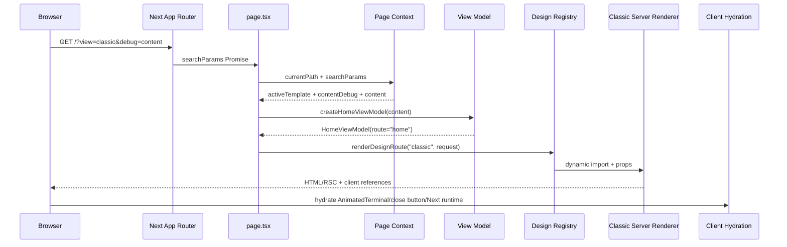

# App Router 요청, server rendering과 hydration 경계

URL의 `view`와 `debug`를 서버가 해석하고 route view model을 만든 뒤 선택한
renderer가 HTML/RSC를 생성한다. 브라우저에서는 native HTML 동작, Next.js
navigation과 두 first-party Client Component만 추가로 실행된다. 이 문서는
한 요청이 어느 진입점을 지나며 React state와 DOM state의 소유자가 어떻게
달라지는지 설명한다.

## 실행 진입점

실행 명령과 공개 진입점은 다음처럼 연결된다.

```text
npm run dev
└─ next dev --webpack -p 3100

npm run build
├─ prebuild: content:check + content:ready
└─ next build --webpack

npm run start
└─ next start -p 3100
```

`src/app`은 Pages Router가 아니라 App Router 구조다.

| 파일 | 공개 결과와 책임 |
| --- | --- |
| `layout.tsx` | 모든 route의 `<html>/<body>`, local font, `globals.css`, root metadata와 site JSON-LD |
| `page.tsx` | `/` home |
| `projects/page.tsx` | `/projects` |
| `projects/[projectId]/page.tsx` | dynamic project detail |
| `about/page.tsx` | `/about` |
| `resume/page.tsx` | `/resume` |
| `contact/page.tsx` | `/contact` |
| `journey/page.tsx` | `/journey` |
| `interview-map/page.tsx` | `/interview-map` |
| `not-found.tsx` | route가 `notFound()`를 호출하거나 ID가 없을 때의 전역 404 |
| `robots.ts`, `sitemap.ts` | 화면 renderer 밖의 metadata route |
| `favicon.ico` | file-based icon |
| `globals.css` | Tailwind v4 import, 전역 role token과 공용 CSS |

page 파일이 route의 leaf이고 layout의 `children` 자리에 결과가 들어간다.
layout과 page는 기본적으로 Server Component다. CSS와 public asset URL은
server/client 경계와 별개의 정적 입력이다.

## 홈 요청을 끝까지 추적하기

`/?view=classic&debug=content` 요청은 다음 경로를 지난다.



`resolvePortfolioPageContext()`는 URL query를 `await`하고 다음 값을 만든다.

- `activeTemplate`: 지원하는 `view` 또는 콘텐츠의 기본 design
- `contentDebug`: `debug`가 정확히 `content`인지
- `content`: 검증·정규화된 canonical content의 얕은 envelope
- `shellProps`: site/profile/presentation와 switcher 입력

현재 page는 `activeTemplate`, `content`, `contentDebug`를 사용한다.
Design·Classic renderer는 `createDesignShellProps()`로 shell props를 다시
조립하므로 page context가 반환한 `shellProps`는 page에서 소비하지 않는다.

`createHomeViewModel()`은 featured project, lead project, metrics, 최근 journey,
link와 current year를 계산한다. registry가 Classic module을 import하고
`classic/home-route.tsx`가 `PageShell`, profile copy와 `AnimatedTerminal`을
서버 tree에 놓는다.

## params, searchParams와 render 시점

Next.js 16에서 page의 `params`와 `searchParams`는 Promise다. 이 프로젝트의
`RouteSearchParams`도 Promise 형태를 허용하며 page context가 `await`한다.

`searchParams`는 값이 request 전에는 정해지지 않는 Dynamic API다. 모든 화면
page가 이를 읽어 design과 debug 상태를 고르므로 page 결과는 요청 시 renderer
선택을 수행한다. root `generateMetadata()`도 template mode에서 `headers()`를
읽어 metadata origin을 정한다.

프로젝트 상세는 다음처럼 ID 목록을 build에 제공한다.

```tsx
// 현재 src/app/projects/[projectId]/page.tsx
export function generateStaticParams() {
  return getPortfolioContent().projects.map((project) => ({
    projectId: project.id,
  }));
}
```

이는 현재 project ID를 prerender 후보로 열거한다. 파일은
`dynamicParams = false`를 선언하지 않으므로 목록 밖 ID를 framework 수준에서
미리 닫는 계약은 아니다. 실제 page가 ID를 view model로 찾은 뒤 없으면
`notFound()`를 호출한다. `searchParams`도 읽기 때문에 “상세가 전부 고정 정적
HTML이다”라고 설명하면 안 된다.

`robots.ts`와 `sitemap.ts`는 request-time API나 dynamic config를 사용하지
않는다. Next.js의 metadata special route는 그런 opt-out이 없으면 기본적으로
캐시된다. page/layout의 runtime env 평가와 metadata route가 같은 시점에 같은
값을 읽는다고 가정하지 않는다. build manifest와 저장된 결과는 현재 checkout의
분류를 대신하지 않으므로 변경 뒤 build와 응답을 다시 확인한다.

- [Next.js page와 searchParams](https://nextjs.org/docs/app/api-reference/file-conventions/page)
- [dynamic route와 generateStaticParams](https://nextjs.org/docs/app/api-reference/file-conventions/dynamic-routes)
- [metadata file cache](https://nextjs.org/docs/app/api-reference/file-conventions/metadata)

## route별 조립과 404

각 page는 다음 책임만 갖는다.

1. page가 비활성인지 확인한다.
2. route metadata의 title·description·canonical path를 선택한다.
3. `params`와 `searchParams`를 해석한다.
4. 자신의 route view model creator를 호출한다.
5. design registry에 route와 정확히 맞는 view model을 넘긴다.

프로젝트 상세는 `params.projectId`를 읽고
`createProjectDetailViewModel()`이 `null`이면 `notFound()`를 호출한다.
production mode의 project JSON-LD도 이 page가 renderer와 나란히 출력한다.
없는 ID나 비활성 page를 다섯 renderer가 각각 판정하지 않는다.

전역 `not-found.tsx`는 design registry 바깥의 generic `PageShell`을 사용하고
영어 고정 문구를 가진다. 요청의 `view`를 보존하지 않는다. 다섯 renderer 내부에
남아 있는 “project 없음” branch는 정상 App Router 흐름에서는 page가 먼저
404를 결정하므로 대체 경로에 가깝다.

## React component와 props

React component는 props를 입력으로 받아 element tree를 반환하는 함수다.
`RootLayout({ children })`에서 `children`은 현재 route page 결과다.
`ProjectCard({ project, homeTemplate, contentDebug })`는 project를 소유하지
않고 전달받은 값을 표시한다. 원본과 공유 객체의 소유권은 server content
module에 남는다.

조건부 렌더링은 실제 optional/nullable 상태와 연결된다.

```tsx
{profile.photo ? <ProfilePhoto photo={profile.photo} /> : null}
{siteStructuredData ? <StructuredData data={siteStructuredData} /> : null}
```

list 렌더링은 project ID, section ID, link ID/href처럼 같은 항목을 다시
식별할 안정된 `key`를 사용한다. key는 DOM에 표시되는 props가 아니라 React가
형제 항목의 identity를 비교하는 값이다. index만 key로 쓰면 순서 변경이 state나
DOM identity를 다른 항목에 붙일 수 있다.

renderer 대부분은 props와 view model에서 바로 계산할 수 있어 state가 필요
없다. `Reveal`도 과거 client observer를 제거하고 지금은 `children`을 감싼
정적 server component다. project count, filtered links, section mapping 같은
derived value를 별도 state로 복제하지 않는다.

## state와 다시 렌더링

현재 first-party React state는 Classic home의 `AnimatedTerminal`에만 있다.

```ts
const [commandIndex, setCommandIndex] = useState(0);
const [typedCommand, setTypedCommand] =
  useState(commands[0]?.command ?? "");
const [phase, setPhase] =
  useState<"typing" | "hold" | "erase">("hold");
```

component가 다시 렌더링되는 주된 조건은 다음과 같다.

- `setTypedCommand`, `setPhase`, `setCommandIndex`로 local state가 바뀐다.
- 부모가 새 props를 전달한다.
- route navigation으로 server payload가 바뀌고 해당 client tree가 갱신된다.

`commands`는 terminal props와 profile/count를 입력으로 `useMemo`에서
파생한다. memo는 correctness의 소유자가 아니라 같은 dependency 동안 계산을
재사용하는 최적화다.

native `<details>`의 `open`은 React state가 아니다. 브라우저 DOM이 소유한다.
design 선택 상태는 URL이 소유한다. remote server state나 fetch cache로
동기화하는 애플리케이션 state는 없다.

## effect, timeout 소유권과 cleanup

terminal effect는 현재 phase에 맞는 timeout 하나를 예약한다.

```text
hold --1700ms--> erase --24ms 반복--> 빈 문자열
→ 다음 command index --220ms--> typing --42ms 반복
→ 완성 --520ms--> hold
```

effect가 실행될 때 timer queue는 브라우저가 소유하고 component는 timeout
handle을 갖는다. dependency가 바뀌거나 component가 unmount되면 cleanup이
`clearTimeout(timeout)`을 호출한다. 이 정리가 없으면 이전 phase의 callback이
새 state에 개입하거나 unmount 뒤에도 작업이 남을 수 있다.

`prefers-reduced-motion: reduce`이면 effect는 timeout을 만들지 않고 종료한다.
server에는 `window`와 `matchMedia`가 없으므로 이 API는 effect 안에서만 읽는다.

schema는 `terminal.commands` 배열에 `.min(1)`을 두지 않는다. 빈 배열이면
초기 typed text는 빈 문자열로 만들어지지만 `activeCommand`는 `undefined`이고
effect dependency와 render가 `.command`/`.output`을 읽어 실패한다. state
machine의 불변식은 “command가 한 개 이상 있다”이며 현재 runtime schema가 이를
완전히 보장하지 않는다.

## event handler와 native 동작

`DesignSwitcher`는 Server Component가 `<details>`, `<summary>`, `<nav>`와
design link를 렌더링한다. 브라우저는 JavaScript가 없어도 summary click과
keyboard 입력으로 disclosure를 열고 닫는다.

`DesignSwitcherClose`는 `"use client"` component다. click event handler가
가장 가까운 details에서 `open`을 제거하고 직접 자식 summary로 focus를 돌린다.
새 local state를 만들지 않고 이미 브라우저가 소유한 DOM state를 갱신한다.

mobile navigation도 native `<details>`를 사용한다. dialog가 아니므로 focus
trap이나 Escape close를 제공하지 않는다. close 후 focus 복귀는 design
switcher의 명시적 close button에만 구현되어 있다.

## server HTML과 hydration 범위

Server Component renderer는 profile, project, navigation, contact, heading과
대부분의 section을 HTML/RSC로 만든다. JavaScript가 실행되기 전에도 콘텐츠와
native link/details가 보인다.

first-party `"use client"` 선언은 다음 두 파일뿐이다.

| Client Component | hydration 뒤 추가하는 동작 |
| --- | --- |
| `animated-terminal.tsx` | local state, timeout effect와 reduced-motion 분기 |
| `design-switcher-close.tsx` | click handler, details close와 focus 복귀 |

`next/link`는 App Router client navigation, `next/image`는 framework image
runtime과 연결될 수 있으므로 “두 component만 browser JavaScript를 쓴다”는
말은 first-party directive의 범위에서만 맞다.

### hydration 전후의 terminal

server render와 client의 첫 render는 첫 command가 이미 입력된 `hold` phase로
일치한다. browser가 hydration을 마친 뒤 effect가 erase/typing 순환을 시작한다.
reduced motion이면 첫 정적 command를 유지한다.

### hydration 전후의 design switcher

server는 닫힌 details markup을 보낸다. hydration 전에 사용자가 summary를
누르면 browser가 `open`을 추가할 수 있다. `details`에
`suppressHydrationWarning`을 두어 이 한 속성의 선행 사용자 변경을 유지한다.
텍스트나 tree 구조의 불일치를 숨기는 일반 해법으로 사용하지 않는다.

컴포넌트 test는 server string → DOM 삽입 → `details.open = true` →
`hydrateRoot()` 순서를 재현하고 open 유지와 hydration console error 부재를
확인한다.

## mismatch를 만드는 값과 현재 회피

server와 첫 client render가 다음 값을 따로 계산하면 HTML이 달라질 수 있다.

- `Date.now()`나 server/client timezone에 따른 문자열
- `Math.random()`
- `window.innerWidth`, viewport와 media query
- browser locale에 의존하는 날짜/숫자 형식
- browser storage/cookie에서만 읽은 값

현재 renderer는 난수나 viewport 기반 render를 사용하지 않는다. terminal의
`matchMedia`는 effect까지 미룬다. journey 날짜는 locale formatter 대신 문자열
slice를 사용한다. `currentYear`는 server에서 view model을 만들 때 계산되어
동일 payload로 전달되므로 hydration 중 다시 계산하지 않는다. 다만 연말의 server
timezone이 사용자 기대 연도와 다를 수 있고 journey date 형식은 schema가
검증하지 않는다.

## navigation과 유휴 network

내부 navigation과 design 선택은 Next.js `Link`를 사용하고 주요 link는
`prefetch={false}`다. URL을 상태 소유자로 유지하면서 사용하지 않은 design의
RSC를 초기 유휴 시간에 미리 요청하지 않으려는 정책이다.

`performance.spec.ts`는 다섯 home과 첫 project detail에서 초기 1초 동안 `_rsc`
prefetch와 지정한 미사용 font 요청을 찾는다. focus/hover 뒤의 모든 prefetch나
장시간 session을 금지하는 검사는 아니다.

interaction test는 design switcher close와 mobile menu open을 Event Timing으로
세 번 측정해 median/max 200ms 조건을 적용한다. 지정한 두 상호작용의 Chromium
실험실 측정이며 실제 사용자 전체 INP를 대신하지 않는다.

## 실패와 복구 경계

| 조건 | 소유 경계와 결과 | 복구 |
| --- | --- | --- |
| `view` 없음/잘못됨 | selector가 기본 design 사용 | 같은 요청에서 정상 renderer |
| query 배열 | 첫 값만 사용 | selector |
| 비활성 page | page가 renderer 전 `notFound()` | global 404 |
| 없는 project ID | detail view model `null` | page의 `notFound()` |
| renderer dynamic import 실패 | server render 실패 | 별도 fallback 없음 |
| terminal command 없음 | client/server render 중 undefined 접근 가능 | schema가 현재 막지 않음 |
| hydration 전 details open | browser DOM 상태 유지 | 해당 속성 warning만 억제 |
| close click | open 제거, summary focus | 작은 client event handler |
| browser API를 server render에서 읽음 | `window is not defined` 또는 mismatch | Client Component/effect 경계로 이동 |
| proxy host/proto 오류 | template metadata origin 오류 | proxy 신뢰 설정 또는 production `SITE_URL` |

## 검증이 닫는 범위

- Vitest는 page 조립, view model key, server render와 JSDOM hydration 반례를
  확인한다. 실제 CSS layout과 모든 browser details 구현은 증명하지 않는다.
- Playwright는 다섯 design×활성 route, URL 보존, hydration console, overflow,
  mobile navigation, focus와 reduced motion을 Chromium desktop/mobile
  profile에서 확인한다.
- axe는 정의된 자동 규칙을 확인하지만 heading 의미, alt 품질, 새 창 고지,
  screen reader와 고대비/확대를 판단하지 않는다.
- 문서 작성에서는 npm, build와 browser test를 실행하지 않았다. 설정과
  기존 test를 읽어 경계를 확인했으며 현재 통과를 새로 검증한 것은 아니다.
