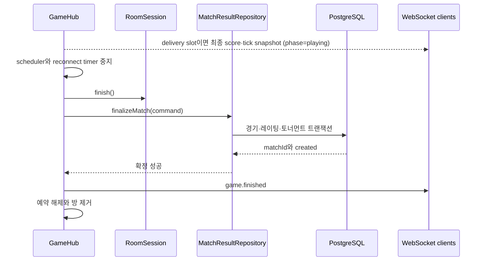
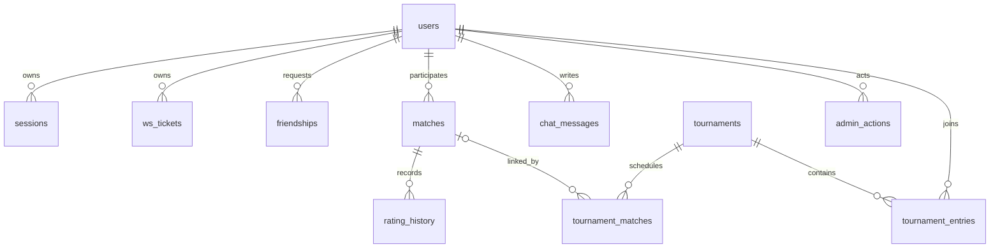

# 경기 결과 확정과 데이터 일관성

경기 종료는 메모리 상태 전이이고 결과 저장은 별도의 저장소 작업이다. 서버가
승자를 계산했더라도 DB 트랜잭션이 실패하면 `game.finished` 성공 이벤트를
보내지 않는다. 종료 tick의 cadence snapshot은 저장보다 먼저 전송될 수 있지만,
최종 점수와 tick만 반영되고 `phase`는 여전히 `playing`이다. 등록 경기의
브라우저는 저장 성공 뒤 `game.finished`를 받아야 종료 상태로 전이한다.

`AppRepository`는 인증, 사용자, 친구, 채팅, 경기, 토너먼트와 관리 작업을 한
interface에 모은다. `GameHub`는 그중 필요한 method만 `Pick`하고 결과 저장
경계는 `MatchResultRepository`로 더 좁힌다. PostgreSQL 구현이 Kysely와 pg
pool을 소유하고 API close hook이 repository `close()`를 호출한다. Pool은
library 기본 크기·timeout을 사용하며 transaction retry 정책은 없다.

## 방 종료 순서

`GameHub.finishRoom`은 방마다 `finishing` Promise 하나를 둔다. 동시에 여러 종료 조건이 들어오면 같은 Promise를 돌려주므로 저장소 명령을 중복 시작하지 않는다.

등록 경기의 순서는 다음과 같다.

저장소가 실패하면 `game.finished`를 보내지 않는다. 그러나 `tick`은
`syncSnapshot` 뒤 전송 cadence를 먼저 확인하고 그 다음 `finishRoom`을
시작하므로, 해당 tick이 delivery slot이면 최종 점수와 tick을 담은 snapshot은
이미 나갔을 수 있다. `syncSnapshot`은 simulation의 `phase`를 복사하지 않아
이 snapshot의 phase는 `playing`이고 reducer도 화면 status를 `finished`로
바꾸지 않는다. 그 뒤 `finalizeRoom`이 server의 room session과 snapshot을
`finished`로 바꾸고 저장을 시도한다. 실패하면 같은 result key와 단일 in-flight를
유지한 capped-backoff timer로 재시도한다. 성공 뒤에만 이벤트와 방 정리를 한 번
수행한다. API가 종료되면 이 process-local retry와 메모리 방도 사라진다.

게스트는 이 흐름에서 저장소를 건너뛴다. 비영속 결과를 메모리에 잠시 보관하고 이벤트를 보낸 뒤 방을 제거한다.

## `resultKey`가 막는 중복 확정

`GameHub`는 방 종료에 `room:${room.id}:finished` 형식의 `resultKey`를 만든다. PostgreSQL의 `matches.result_key`는 unique이고 `finalizeMatch`는 먼저 충돌을 허용하는 insert를 시도한다.

- 새 key면 경기 행을 만든 뒤 후속 변경을 수행한다.
- 이미 있는 key면 기존 `matchId`를 반환하고 레이팅과 토너먼트를 다시 바꾸지 않는다.
- 반환값의 `created`로 처음 처리인지 재호출인지 구분한다.

멱등성 범위는 같은 `resultKey`다. 일반·AI 경기를 다른 key로 다시 보내면 별도 결과로 저장될 수 있다. 토너먼트는 이미 연결된 대진 검사도 있어 다른 key의 중복 확정을 되돌린다. 반대로 기존 key를 다른 승자·점수와 함께 보내면 저장된 payload와 비교하지 않고 기존 결과를 성공으로 반환한다. 호출자가 충돌하지 않는 안정적인 key를 만들고 재호출 payload를 바꾸지 않아야 한다.

메모리 저장소도 같은 key를 배열에서 찾아 중복을 막는다. 단일 JavaScript 프로세스 안에서는 같은 동작을 하지만 영속 unique 제약이나 crash rollback을 제공하지 않는다.

## PostgreSQL 트랜잭션 안에서 바뀌는 것

새 결과를 확정할 때 한 트랜잭션이 다음 작업을 묶는다.

1. `matches` 행 생성
2. 참가자 ID를 정렬한 뒤 사용자 행을 `FOR UPDATE`로 잠금
3. 승·패 횟수와 레이팅 변경
4. 참가자별 `rating_history` 생성
5. 토너먼트 경기라면 대진과 토너먼트 행 잠금
6. 대진에 결과 연결
7. 준결승이 모두 끝났으면 결승 대진 생성, 결승이면 토너먼트 종료

사용자 ID를 정렬하고 같은 순서로 잠그므로 서로 반대편으로 참가한 경기들이 동시에 끝날 때 교착 가능성을 줄인다. 토너먼트 대진이 없거나 참가자가 맞지 않거나 이미 다른 경기 결과가 연결돼 있으면 전체 트랜잭션을 되돌린다.

승자와 패자의 레이팅 변화는 서로 다르고 패자에게 하한이 있다. `matches.rating_delta`와 `game.finished.ratingDelta`는 승자 쪽 변화량 하나만 나타내므로 참가자별 실제 변화는 `rating_history`를 봐야 한다.

## table 관계와 DB가 실제로 막는 것

그림의 `users` 관계는 한 사용자가 여러 child row와 연결된다는 개념 지도다.
`matches`의 winner·loser, `tournament_matches`의 player처럼 한 table 안에
여러 nullable FK role이 있으므로 각 row의 정확한 최소 cardinality를 한 edge로
표현한 것은 아니다. `tournament_matches.match_id`도 nullable이고 unique가
아니라 한 match row를 여러 대진 row가 참조하는 것을 DB가 직접 막지 않는다.

| table | primary·unique | 주요 foreign key와 수명 |
| --- | --- | --- |
| `users` | UUID PK, unique email·handle | 사용자 root. 여러 child는 delete cascade지만 match·tournament creator처럼 cascade가 아닌 참조도 있다. |
| `sessions` | token PK | user 삭제 시 cascade, `expires_at`은 조회 조건 |
| `ws_tickets` | 64자리 hash PK와 format check | user 삭제 시 cascade, expiry index |
| `friendships` | UUID PK, canonical user pair unique | 두 user 삭제 시 cascade, self pair check |
| `matches` | UUID PK, unique `result_key` | winner·loser user, ended time index |
| `rating_history` | UUID PK, unique `(match_id,user_id)` | match·user 삭제 시 cascade, user/time index |
| `chat_messages` | UUID PK | sender 삭제 시 cascade, scope/time index |
| `tournaments` | UUID PK | creator·winner user |
| `tournament_entries` | UUID PK, unique user와 seed per tournament | tournament·user 삭제 시 cascade |
| `tournament_matches` | UUID PK, unique round/slot per tournament | tournament, users, result match |
| `admin_actions` | UUID PK | actor·target user와 audit 내용 |

DB가 모든 Zod·TypeScript 규칙을 반복하지는 않는다. `role`, `status`, match
`mode`, tournament `status`·`round`, chat `scope`는 text다. score·rating·wins,
losses, seed·slot·capacity와 chat body 길이에도 해당 범위의 CHECK가 없다.
winner와 loser가 다른 사용자라는 제약도 없다. application schema와 domain
검사가 우회되면 DB가 이 값을 모두 거절한다고 가정하면 안 된다.

반대로 canonical friendship, tournament 정원·seed, result key와 rating history
중복처럼 동시 request가 깨뜨릴 수 있는 핵심 조합은 unique constraint·row lock과
transaction을 함께 사용한다.

## 토너먼트의 두 트랜잭션 경계

토너먼트에는 방 시작과 경기 종료라는 두 저장 경계가 있다.

- 시작: `GameHub`가 방을 만든 뒤 `startTournamentMatch`로 대진에 `roomId`를 연결
- 종료: `finalizeMatch`가 경기 결과, 레이팅, 대진과 다음 라운드를 함께 확정

시작 단계는 메모리 방과 DB를 하나로 묶지 못한다. DB 변경이 실패하면 방을 폐기하는 보상만 수행한다. 또한 `startTournamentMatch`는 현재 `running` 대진도 다시 갱신할 수 있어 재호출이 기존 `roomId`를 덮을 수 있다.

종료 단계는 DB 내부 변경을 하나로 묶지만 메모리 방 제거까지 포함하지 않는다. DB 확정 직후 프로세스가 종료되면 결과는 남고 사용자에게 이벤트는 전달되지 않을 수 있다. 재접속한 등록 사용자는 HTTP 결과 조회로 확인해야 한다.

## 친구와 토너먼트 정원

친구 관계는 방향과 무관한 한 쌍만 허용한다.

- 자기 자신과의 관계를 check 제약으로 거절한다.
- 두 사용자 ID의 작은 값과 큰 값 조합에 unique index를 둔다.
- 반대 방향 요청이 이미 있으면 새 행 대신 기존 관계를 수락 상태로 바꾼다.

토너먼트 참가는 토너먼트 행을 잠근 뒤 현재 인원과 다음 seed를 계산한다. 정원이 차는 마지막 동시 요청 중 하나만 들어가며, 꽉 찬 시점에 준결승 대진을 만든다. `(tournament_id, seed)` unique 제약도 잘못된 중복 seed를 막는다.

`createTournament`의 토너먼트 행 생성과 생성자 참가 호출은 하나의 트랜잭션이 아니다. 생성자 참가가 실패하면 빈 토너먼트가 남을 수 있다는 점은 별도 복구 대상이다.

## 관리자 상태와 작업 기록

PostgreSQL의 `setUserBan`은 사용자 `status`·`banned_at` 변경과 `admin_actions` insert를 같은 트랜잭션에서 수행한다. 작업 기록 insert가 실패하면 사용자 상태도 되돌아간다.

이 트랜잭션은 인증 자원까지 포함하지 않는다. 기존 `sessions`와 `ws_tickets`는
삭제하지 않지만 transaction 성공 뒤 API가 GameHub의 해당 queue·좌석·열린
`Client`를 즉시 폐기한다. 계정 정지의 효력 범위는 인증 architecture의 권한표를
따라야 한다.

관리 route와 repository는 actor와 target이 같은지 막지 않으며 admin 화면도
자기 행에 상태 변경 button을 그린다. 유일한 관리자가 자신을 정지하면 다음
관리 요청은 active 검사에서 403이 되고 같은 session으로 해제할 수 없다.
개발 login도 같은 handle을 admin으로 복구하지 않으므로 다른 active admin이나
직접 DB 조치가 필요하다. [관리자 테스트](../apps/api/src/admin.test.ts)는
정지된 기존 admin session의 다음 요청이 거절되는 결과를 고정한다.

메모리 저장소는 같은 API 형태를 제공하지만 실제 DB 트랜잭션은 없다. 프로세스 재시작 시 사용자 상태와 작업 기록이 모두 사라진다.

## Memory와 PostgreSQL의 다른 의미

| 동작 | Memory | PostgreSQL |
| --- | --- | --- |
| session | token→user map, 만료 없음 | 14일 `expires_at` 검사 |
| 개발 seed | 일부 기본 사용자만 process에 준비 | CLI가 사용자·admin·rating별 NPC를 저장 |
| dev login `online` | 바로 true | upsert 응답 mapper는 false, session 조회는 true |
| online·admin 목록 | process object와 다른 고정 의미 | query limit과 mapper 인자로 online 값을 구성 |
| recent PvP 상대 | 상대를 정확히 복원하지 못하고 `"AI"`가 될 수 있음 | join으로 실제 opponent handle 조회 |
| 목록 limit·정렬 | 일부 목록이 전체 array를 반환 | 최근 경기 8, chat 20, leaderboard 20 등 고정 limit |
| transaction·동시성 | 한 JavaScript process의 순차 mutation | DB transaction, row lock, unique constraint |
| crash 수명 | 모두 소멸 | commit된 row 유지 |

Memory는 빠른 단위 검사와 DB 없는 개발 경로이지 PostgreSQL의 충실한 emulator가
아니다. `listOnlineUsers`와 legacy `createMatch`처럼 현재 제품 경로에서는
사용하지 않고 test·호환을 위해 남은 method도 실제 호출 흐름과 구분한다.

## 마이그레이션이 보장하는 것

마이그레이션은 다음 순서로 적용된다.

| 파일 | 주요 역할 |
| --- | --- |
| `001_initial.sql` | 사용자, 세션, 친구, 경기, 채팅, 토너먼트, 관리자 작업 |
| `002_ws_tickets.sql` | 한 번 쓰는 접속권 해시 |
| `003_match_finalization.sql` | `result_key`와 레이팅 이력 |
| `004_friendship_tournament_invariants.sql` | 친구 canonical pair와 토너먼트 seed 제약 |
| `005_expire_legacy_sessions.sql` | 이전 계약의 세션 일괄 만료 |

readiness는 DB 접속뿐 아니라 저장소가 아는 migration 이름 집합과 실제 적용
이름 집합이 맞는지 확인한다. SQL checksum, table·column·constraint의 실제
정의는 비교하지 않는다. 같은 이름의 SQL을 나중에 바꾸거나 `IF NOT EXISTS`가
불완전한 기존 table을 건너뛰어도 `current`일 수 있다.

API 시작 자체가 migration을 수행하지 않으므로 배포의 one-shot `migrate`
작업이 먼저 성공해야 한다. 005는 보존 migration이 아니라 이전 계약의 session
전체를 의도적으로 삭제한다. down migration도 제공하지 않는다.

마이그레이션 반복 테스트는 격리된 작은 schema에서 현재 파일의 순서와 반복 적용을 확인한다. 실제 운영 데이터에서 제약 추가가 만드는 잠금 시간과 이전 애플리케이션 버전의 동시 쓰기 호환성은 보장하지 않는다.

## 실패 지점별 결과

| 실패 지점 | DB | 사용자 이벤트 | 메모리 방 |
| --- | --- | --- | --- |
| 경기 insert 전 | 변경 없음 | 성공 event 없음. cadence에 따라 최종 score·tick과 `phase=playing` snapshot은 이미 보였을 수 있음 | `finished`로 남을 수 있음 |
| 참가자·대진 검증 | 트랜잭션 rollback | 성공 event 없음. cadence에 따라 최종 score·tick과 `phase=playing` snapshot은 이미 보였을 수 있음 | `finished`로 남을 수 있음 |
| DB 확정 뒤 이벤트 전 프로세스 종료 | 결과 확정 | 전달되지 않을 수 있음 | 소멸 |
| 이벤트 전송 오류 | 결과 확정 | 일부 사용자만 수신 가능 | finally에서 제거 |
| 게스트 결과 전송 오류 | DB 변경 없음 | 일부 사용자만 수신 가능 | 최근 결과 보관 뒤 제거 |

저장 성공과 이벤트 전달은 원자적이지 않다. outbox나 사용자별 결과 ACK가 없으므로 클라이언트는 등록 결과를 HTTP로 다시 읽을 수 있어야 한다.

## 확인할 테스트

- `packages/db/src/index.test.ts`: 메모리 멱등성, 친구·토너먼트 규칙
- `packages/db/src/postgres.integration.test.ts`: 마이그레이션 적용·반복, 동시 `finalizeMatch`, rollback, 잠금과 대진 연결
- `apps/api/src/gameHub.runtime.test.ts`: input burst 제한과 repository 오류의 WebSocket redaction
- `apps/api/src/gameHub.reconnect.test.ts`: 몰수패 결과의 단일 확정
- `apps/api/src/admin.test.ts`: 관리자 권한과 계정 상태 변경

정상 simulation 종료→cadence snapshot(`phase=playing`)→server room
`finished` 전이→`finalizeMatch`→success event 순서를 한 GameHub test로 고정한
검사는 없다. DB transaction과 몰수패 종료의 일부 경계를 확인해도 프로세스가
임의 시점에 종료되는 모든 경우를 탐색하지는 않는다. 운영 복구를 요구한다면
미확정 방 journal, 결과 outbox 또는 재처리 명령 중 어떤 계층이 책임질지 먼저
정해야 한다.
