# 입력, 스냅샷, 브라우저 상태의 경계

실시간 경기에는 서로 다른 세 가지 순서가 있다. 클라이언트 입력의 `inputSeq`, 시뮬레이션의 `tick`, 전송 snapshot의 `sequence`다. 하나의 숫자로 합치지 않아야 재전송, 느린 연결, 화면 갱신을 독립적으로 다룰 수 있다.

## 입력이 시뮬레이션에 도달하는 경로

```mermaid
flowchart LR
    keyboard["브라우저 입력"]
    client["GameSocketClient"]
    parser["parseClientEvent"]
    room["Room 조회·playing 확인"]
    seat["좌석 확인"]
    gate["InputGate"]
    step["PongSimulation.step"]
    snapshot["GameSnapshot"]
    buffer["LatestSnapshotBuffer"]
    reducer["gameConnectionReducer"]

    keyboard --> client
    client -->|"inputSeq"| parser
    parser --> room
    room --> seat
    seat --> gate
    gate --> step
    step --> snapshot
    snapshot --> buffer
    buffer -->|"sequence"| reducer
```



공용 WebSocket parser가 이벤트 버전, 타입, `roomId`, 방향 값과 순번 형식을 먼저 확인한다. `GameHub.applyInput`은 이어서 다음 조건을 검사한다.

1. `roomId`가 실제 방을 가리키고 snapshot 상태가 `playing`이다.
2. 보낸 `Client`가 그 방의 좌우 슬롯 중 하나다.
3. `InputGate`가 순번과 빈도를 허용한다.

브라우저가 보낸 위치, 속도, 점수는 입력 계약에 없다. 서버가 저장한 패들 방향만 다음 `PongSimulation.step`에 들어간다.

## `InputGate`의 두 키

입력 순번은 `${userId}\0${roomId}`별로 기억하고, token bucket은 사용자별로 공유한다.

- 같은 방에서 이전 이하의 `inputSeq`는 `stale`로 버린다.
- stale 입력은 token을 소비하지 않는다.
- token이 없으면 `rate_limited` 오류를 보내고 마지막 순번을 갱신하지 않는다.
- 허용된 입력만 순번을 저장하고 token 하나를 쓴다.

사용자별 bucket이므로 여러 방 ID를 바꿔 보내도 빈도 제한을 우회하지 못한다. 반면 순번은 방별이므로 새 방에서 작은 순번으로 다시 시작할 수 있다.

`InputGate.releaseUser`는 소켓이 끊기거나 같은 사용자의 연결을 교체할 때만 호출된다. 정상적인 방 종료에서는 호출하지 않는다. 연결을 유지한 채 여러 경기를 하면 token bucket과 종료된 방의 마지막 순번이 계속 남는다. 사용자마다 끝난 방 수에 비례해 sequence key가 늘 수 있고, 다음 경기의 순간 허용량도 직전 경기의 bucket 상태를 이어받는다. 방 제거 시 key를 정리한다는 보장은 현재 없다.

브라우저와 server의 방향 사본도 자동으로 합쳐지지 않는다. Browser는 keyup,
blur와 visibility change에서 방향 0을 보내지만 pause 중인 server는
`playing`이 아닌 입력을 버린다. 이를 보완해 pause 진입이 양쪽 paddle의 방향을
0으로 초기화하므로 keyup이 버려져도 resume 뒤 예전 방향이 다시 적용되지 않는다.

`changeDirection`은 send 결과보다 먼저 local ref를 바꾼다. Reconnecting 중
닫힌 socket으로 보낸 방향은 유실돼도 ref가 남고, room ID가 바뀌지 않아
reset effect도 실행되지 않는다. 복구 뒤 같은 방향 입력이 local 중복으로
억제될 수 있다. Snapshot을 authoritative하게 그리는 것과 입력 사본을
authoritative하게 다시 맞추는 일은 별도 문제이며, 이 pause·reconnect 순서의
통합 검사는 없다.

## 틱과 snapshot 순번

공유 스케줄러는 고정 간격으로 진행 중인 방을 순회한다. event loop가 늦어지면 accumulator가 제한된 수만 따라잡고 오래된 지연 일부를 버린다. 시뮬레이션 시간을 실제 벽시계와 억지로 맞추기보다 한 loop가 서버를 독점하지 않게 하는 선택이다.

`tick`은 `PongSimulation` 계산 횟수다. `sequence`는 브라우저로 내보내려고 snapshot을 만든 횟수다. 현재는 방마다 delivery slot을 번갈아 배정하고 여러 시뮬레이션 틱 중 일부에서만 snapshot을 만든다. 따라서 두 값은 같을 필요가 없다.

`serverTimeMs`는 snapshot을 만든 서버 시각이다. 다른 장비의 브라우저 시각과 직접 빼면 시계 오차가 포함된다. 서버 내부 delivery histogram도 enqueue부터 `ws.send` callback까지일 뿐 브라우저 parsing과 paint를 포함하지 않는다.

## 느린 소켓에는 최신 상태만 남긴다

`LatestSnapshotBuffer`는 `bufferedAmount`에 따라 전송을 세 단계로 나눈다.

| 소켓 상태 | 처리 |
| --- | --- |
| soft 한도 이하 | snapshot을 즉시 전송 |
| soft 초과, hard 미만 | 최신 snapshot 하나만 남기고 짧게 재시도 |
| hard 이상 또는 혼잡 지속 | 연결 종료 |

대기 중 새 snapshot이 오면 이전 값을 `replaced`로 기록하고 최신 값으로 바꾼다. 경기는 중간 프레임을 모두 재생하는 것보다 가장 최근 권위 상태로 따라잡는 편이 낫기 때문이다.

snapshot이 아닌 `queue.matched`, 채팅, 오류, `game.finished` 같은 이벤트는 최신값 교체 대상이 아니다. 다만 hard 한도 이상이면 해당 연결을 종료하고, `send` callback이 실패해도 열린 소켓을 종료한다.

`bufferedAmount`는 실제 소켓 송신 대기량을 나타내지만 네트워크 왕복 시간이나 브라우저 처리 속도를 직접 알려주지는 않는다. snapshot drop 지표를 사용자 화면 지연과 같은 값으로 해석하면 안 된다.

## 연결 세대와 늦은 callback

`GameSocketClient`는 연결을 시작할 때 generation을 올린다. ticket 요청, WebSocket과 모든 callback이 자신이 만들어진 generation과 현재 socket을 함께 확인한다.

이전 연결의 ticket 응답, open, message, close가 늦게 도착해도 새 연결의 상태를 바꾸지 않는다. 새 연결이 성공하면 입력 순번과 재접속 시도 횟수를 초기화한다. 서버도 연결 교체 시 이전 `InputGate` 상태를 지우므로 새 소켓의 입력 순번을 다시 시작할 수 있다.

generation은 같은 클라이언트 객체 안의 비동기 경쟁만 막는다. 서버 방의 재접속 기한을 연장하거나, 이미 전송 대기 중인 서버 snapshot의 의미를 바꾸지는 않는다.

Ticket provider 오류는 `onFailure` 또는 reconnect로 처리하지만
`socketFactory(url)`은 그 catch 밖에서 호출한다. 잘못된 build-time WS URL로
WebSocket 생성자가 동기 예외를 던지면 page가 `void`로 버린 connect Promise가
reject하고 reducer는 `connecting`에 남을 수 있다. Generation이 이 생성 실패를
UI 오류로 바꾸지는 않는다.

재접속은 250ms에서 시작해 최대 2초까지 지수적으로 늦추며 명목상 15초
window를 둔다. 하지만 socket `open` 때 시도 횟수와 deadline을 초기화한다.
room 복구 event를 확인한 시점이 아니므로 open과 close가 반복되면 첫 단절부터
15초를 넘겨 재시도할 수 있다. ticket request와 CONNECTING socket에도 별도
timeout이 없다.

Lobby page는 이 client를 사용하지 않고 effect 안에서 `WebSocket`을 직접
소유한다. ticket request abort, handler 제거와 close cleanup은 하지만
reconnect가 없다. `parseServerEvent` exception도 잡지 않으므로 잘못된 server
message를 controlled UI failure로 바꾸지 못한다. Game socket은 parser 실패를
`onFailure`로 전달하지만 socket을 즉시 닫지는 않는다.

## 브라우저 reducer가 지키는 것

`gameConnectionReducer`는 연결 상태를 `idle`부터 `finished`까지 명시적으로 관리한다. snapshot은 마지막으로 수락한 `sequence`보다 클 때만 적용하므로 중복과 역순 전달을 버린다. 새 매칭 연결을 시작하면 이전 방 ID, snapshot, sequence와 채팅을 초기화한다.

현재 종료 순서에는 빈틈이 있다.

1. 서버 snapshot이 혼잡 때문에 `LatestSnapshotBuffer`에 대기한다.
2. 경기가 끝나 등록 결과가 확정된다.
3. 서버가 일반 이벤트 경로로 `game.finished`를 보낸다.
4. 대기하던 더 큰 `sequence`의 이전 snapshot이 나중에 전송될 수 있다.
5. reducer는 `gameFinished` 뒤라는 사실을 확인하지 않고 더 큰 sequence를 수락해 `playing` 또는 `paused` 상태와 `roomId`를 되살릴 수 있다.

`gameFinished` 처리에서 sequence를 봉인하거나, 종료 이벤트와 snapshot의 단일 전송 순서를 만들거나, reducer가 `finished` 뒤 같은 방의 비종료 snapshot을 무시해야 이 경쟁을 없앨 수 있다. 현재 테스트는 낮거나 같은 sequence 거절은 확인하지만 이 종료 후 도착 순서는 고정하지 않는다.

순번이 없는 chat event도 room filter를 적용한다. `useGameConnection`은
`scope: "match"`이며 현재 `roomId`와 같은 message만 매치 채팅 문자열로 만든다.
Server도 sender 좌석 확인 뒤 해당 room audience로만 방송한다. Snapshot room ID
방어와 별도로 event별 구독 범위를 양쪽에서 유지한다.

## Canvas 보간과 보이는 상태

`PongCanvas`는 받은 snapshot을 최대 8개까지 복사해 browser `performance.now()`
수신 시각과 함께 보관한다. animation frame마다 약 80ms 과거의 목표 시각을
잡고 그 앞뒤 sample의 paddle·ball 위치를 선형 보간한다.

```text
authoritative server state ── network ── received samples
                                         └─ 약 80ms 과거 위치를 Canvas에 표현
```

server `serverTimeMs`나 RTT로 clock을 맞추지 않으므로 80ms는 network delay를
정확히 상쇄하는 값이 아니다. sample의 local arrival 간격을 부드럽게 잇는
표현 지연이다. score, phase, tick은 snapshot 값을 그대로 사용하며 browser가
충돌·점수·승패를 다시 계산하지 않는다.

client prediction과 extrapolation은 없다. 새 입력 직후에도 server snapshot이
올 때까지 보이는 paddle에 지연이 생긴다. 다만 reconnect 전환에서 reducer는
기존 snapshot을 지우지 않고 `PongCanvas`도 prop이 `null`일 때만 sample
buffer를 비운다. 복구된 새 authoritative snapshot은 기존 최대 8개 sample 뒤에
추가돼 끊기기 전 위치와 잠시 보간될 수 있다. 새 상태를 결국 수락하는 것과
reconnect 순간 render history를 즉시 초기화하는 것은 다르며 후자는 구현돼
있지 않다.

Canvas는 mount에서 device pixel ratio에 맞춘 960×540 buffer와 CSS 크기를
정하고 rAF를 cleanup한다. 이후 window resize·DPR 변경을 추적하지 않고,
Canvas 내용을 대체하는 접근 가능한 score·phase text도 Canvas 자체에는 없다.
현재 E2E는 불투명 pixel이 존재하는지만 확인하며 보간의 시간·좌표 정확도와
resize를 검증하지 않는다.

## 실시간 상태와 HTTP 캐시

`useGameConnection`은 WebSocket 이벤트를 reducer에 전달할 뿐 React Query cache를 직접 갱신하지 않는다. 등록 경기 종료 뒤 대시보드·리더보드·프로필을 최신으로 보려면 해당 화면이 다시 조회하거나 명시적으로 query를 무효화해야 한다.

반대로 query 결과를 진행 중인 방의 권위 상태로 사용해서도 안 된다. 방은 API 메모리에 있고 snapshot이 현재 점수와 위치의 원본이다.

401 browser event는 private query 일부를 지우고 `me`를 null로 바꾸지만 다른
사용자 login 성공은 `me`와 lobby를 중심으로만 무효화한다. 이전 dashboard,
`ownProfile`·friends cache가 stale time 동안 남을 수 있다. mutation은 optimistic
update를 하지 않아 rollback은 없지만, 성공 후 무효화 key를 빠뜨리는 stale
data 문제는 별도로 남는다.

## 확인할 테스트와 측정 원본

- `apps/api/src/game/inputGate.test.ts`: 순번, rate limit, 사용자 정리
- `apps/api/src/game/fixedStepScheduler.test.ts`: 지연 누적과 따라잡기 상한
- `apps/api/src/game/latestSnapshotBuffer.test.ts`: 최신값 교체, 혼잡 종료, callback 오류
- `apps/api/src/gameHub.snapshotCadence.test.ts`: 방별 전송 주기 분산
- `apps/web/src/game/GameSocketClient.test.ts`: 세대와 ticket 요청 취소
- `apps/web/src/game/gameConnection.test.ts`: 상태 전이와 snapshot 순번

재현 가능한 부하 실행 결과는 [`docs/measurements/load-2026-07-24.json`](../docs/measurements/load-2026-07-24.json)에만 기록한다. 이 파일의 지연값은 해당 실행 환경의 결과이며 브라우저 렌더링 SLA가 아니다.
