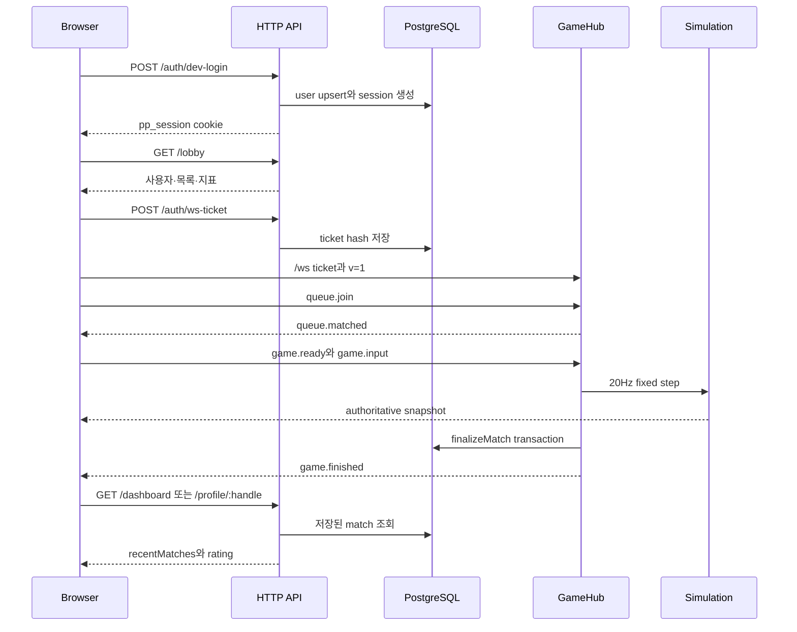
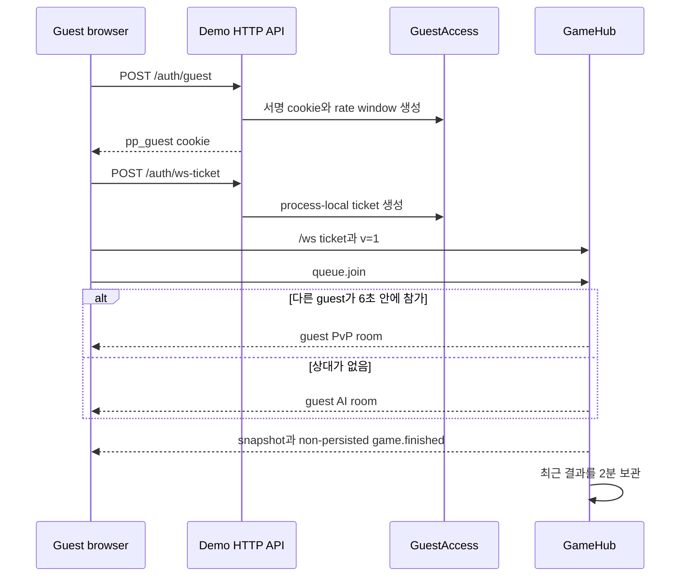

# 사용자 흐름과 시스템 경계

Pong Pong은 Next.js web, Fastify API, shared contract와 repository package로
나뉜 workspace다. 이 문서는 사용자가 화면을 움직일 때 HTTP, WebSocket,
process memory와 DB에서 어떤 상태가 바뀌는지 연결한다. 인증 수명, room,
snapshot, 결과 transaction과 운영 수명은 각각의 상세 architecture가 맡는다.

## 모듈별 소유권

| 영역 | 소유하는 것 | 소유하지 않는 것 |
| --- | --- | --- |
| `packages/shared` | HTTP DTO·오류, WebSocket event, snapshot의 Zod schema와 파생 type | session 조회, room 소유권, 경기 판정, 저장 |
| `packages/db` | repository interface, Memory/PostgreSQL 구현, migration·seed CLI | HTTP status, WebSocket, scheduler |
| `apps/api` | route 인증·인가, ticket 교환, connection, queue, room, simulation, 결과 확정 순서 | browser route·cache·paint |
| `apps/web` | page, HTTP query cache, socket generation, reducer, Canvas 표현 | 점수·승자, DB transaction |
| Caddy·Compose | 공개 path, service network와 시작 순서 | 사용자 권한, room·result 상태 |

shared schema를 함께 사용한다는 사실은 세 구성 요소가 같은 상태를 소유한다는
뜻이 아니다. browser의 `SessionUser`, 열린 connection의 `Client.user`, DB의
`users` row는 서로 다른 시점의 사본이다.

## Next.js 진입점과 화면 상태

`apps/web/src/app/layout.tsx`는 metadata와 HTML shell을 만드는 Server
Component다. `QueryProvider` 아래의 route page는 모두 `"use client"`이며
browser API와 React Query를 사용한다. 서버 data를 미리 fetch·dehydrate하는
page는 없다.

| route | 읽는 상태 | 쓰는 동작 | loading·empty·error와 권한 |
| --- | --- | --- | --- |
| `/` | `me`, lobby, lobby WebSocket | dev/guest login, lobby chat | query 전에 login panel·empty 문구가 잠깐 보일 수 있다. Lobby socket은 자동 reconnect가 없다. |
| `/play` | reducer와 authoritative snapshot | queue/AI/tournament join, ready, input, pause/resume, match chat | connecting·matching·waitingReady·playing·paused·reconnecting·finished·failed를 분리한다. |
| `/dashboard` | current user와 최근 8경기 | 없음 | 등록 login 필요. best streak는 전체 기록이 아니라 최근 응답 범위다. |
| `/leaderboard` | rating 기반 순위 | 없음 | demo middleware/API가 막는다. 실제 정렬과 화면 설명이 완전히 같지 않다. |
| `/tournaments` | tournament·bracket | create, join, match 입장 | DB 참가 상태와 memory room 생성이 한 transaction이 아니다. |
| `/profile/[handle]` | 공개 profile과 최근 경기 | friend request, URL 공유 | profile 편집·friend accept/list UI는 없다. |
| `/admin` | user와 audit action | ban/unban | non-demo면 일반 사용자에게도 navigation이 보일 수 있고 API가 최종 403을 결정한다. |

`apps/web/src/middleware.ts`는 demo에서 등록 사용자용 path를 404로 바꾸지만
보안 경계는 API다. middleware가 없는 direct request나 오래된 web build를
고려하면 browser 조건만으로 authorization을 완료할 수 없다.

HTTP query는 React Query가 소유한다. retry는 401을 제외하고 최대 한 번이고,
mutation은 retry하지 않는다. 성공 전에 local list를 바꾸는 optimistic update와
rollback은 없다. mutation 성공 후 정한 query key만 무효화하므로 경기 종료나
사용자 교체 때 빠진 cache가 남을 수 있다.

## 등록 사용자: 로그인부터 결과 조회까지

다음 그림은 PostgreSQL repository를 선택한 배치다. Memory repository도 같은
HTTP·GameHub interface를 지나지만 session·사용자·결과가 process memory에만
남고 DB transaction과 영속 복구는 없다.

1. 개발 login은 user를 만들거나 갱신하고 14일 cookie를 설정한다. 이 route는
   development/test 전용이며 production 사용자 onboarding이 아니다.
2. lobby query가 user·최근 경기·chat·hub stats를 한 HTTP 응답으로 가져온다.
   목록과 stats의 모집단은 같지 않을 수 있다.
3. browser는 cookie를 직접 읽지 않고 ticket endpoint를 호출한다. 30초 ticket의
   hash가 한 번 소비되면 connection의 `Client.user`가 정해진다.
4. `Matchmaker` reservation을 거쳐 `GameHub`가 room과 좌석을 만든다. browser가
   보내는 것은 명령과 방향이며 score·winner가 아니다.
5. room 종료 시 같은 process의 `room.finishing`이 중복 실행을 막고, 저장이
   일시 실패하면 GameHub가 같은 key로 capped-backoff 재시도한다. PostgreSQL은
   `resultKey` unique와 transaction을 더하고, Memory는 한
   process의 배열 검색과 순차 mutation만 제공한다.
6. repository 성공 뒤 종료 event가 전송된다. PostgreSQL에서는 event를
   놓쳐도 HTTP 재조회가 영속 결과의 기준이다. Memory에서는 같은 process가
   살아 있는 동안만 재조회할 수 있다.

현재 browser E2E는 AI room의 playing·pause·chat까지 확인하지만 경기 종료와
dashboard 결과 조회를 한 시나리오로 잇지 않는다. 이 종단 흐름은 현재 코드
경로를 연결한 설명이며 검증 범위는 GameHub·repository·smoke·E2E로 나눠 있다.

## 게스트: 접속부터 AI 또는 게스트 경기 종료까지

guest cookie는 서명돼 있지만 payload가 암호화되지는 않는다. 사용자·발급 IP와
2시간 만료가 들어가며 server session row는 없다. ticket, rate window,
connection lease, room과 결과가 모두 한 API process에 있다.

게스트끼리만 queue를 공유하고 6초 뒤 process-local AI로 전환한다. 등록
사용자의 queue fallback은 DB의 rating별 NPC를 고르는 별도 경로다. 게스트는
lobby/match chat, friend, tournament, leaderboard와 admin을 사용할 수 없다.
결과는 `persisted:false`, `matchId:null`이며 rating이나 ranking을 바꾸지 않는다.

guest E2E는 login, 두 guest 매칭, AI fallback과 새 ticket reconnect를
확인하지만 실제 종료와 2분 결과 만료를 끝까지 검사하지 않는다.

## 도메인 기능을 한 흐름으로 연결하기

등록 사용자가 공개 profile에서 friend request를 보내면 다음 경계를 지난다.

1. profile page의 mutation이 `POST /friends/request`를 호출한다.
2. handler가 registered·active인지 확인한다.
3. repository가 상대 handle, 자기 요청과 기존 canonical pair를 처리한다.
4. 성공 응답 뒤 `friends` query key만 무효화한다. 현재 profile 응답에는
   관계 상태가 없어 profile query는 갱신하지 않는다.
5. addressee가 `POST /friends/:id/accept`를 호출하면 repository가 addressee
   소유권을 검사한다.

현재 browser에는 5단계의 friends list·accept UI가 없다. API와 DB가 구현됐다는
사실을 완성된 browser user flow로 표현하지 않는다. friend delete는 route,
repository와 화면 모두 없다.

토너먼트는 HTTP로 만들고 참가한 뒤 ready bracket match의 ID를 WebSocket
`tournament.join`으로 넘긴다. DB tournament 상태와 process memory room을
잇는 경계이므로 한쪽 성공만으로 전체 완료가 아니다. 관리 기능도 page button이
아니라 active admin 확인과 status·audit transaction이 권위 경계다.

## HTTP, 실시간, memory와 DB

| 상태 | 쓰는 경로 | 복구 기준 |
| --- | --- | --- |
| user·session·profile·friend·tournament | HTTP와 repository | DB/Memory 조회 |
| lobby list·dashboard·profile cache | HTTP와 React Query | invalidate 후 재조회 |
| connection·queue·room·input | WebSocket과 `GameHub` | 현재 process memory |
| snapshot 표현 | WebSocket → reducer → Canvas | 최신 authoritative sequence |
| registered match result | room finish → 선택한 repository | PostgreSQL match·rating history 또는 Memory process array |
| guest result | room finish → process map | 2분 TTL 또는 process 종료 |

PostgreSQL을 사용해도 connection과 room을 다른 process가 이어받지 못한다.
반대로 browser cache가 오래됐다고 DB 결과가 되돌아가지는 않는다. 증상을
진단할 때 “서버 상태”를 하나의 저장소처럼 부르지 않고 표의 소유자를 먼저
확인한다.

## route 이동과 cleanup

- lobby effect는 ticket request를 abort하고 handler를 제거한 뒤 socket을 닫는다.
  invalid server message를 잡지 않고 자동 reconnect도 하지 않는다.
- `GameSocketClient`는 ticket AbortController, socket generation과 reconnect
  timer를 소유한다. 새 연결·unmount에서 이전 callback을 폐기한다.
- play page는 keyboard, blur, focus, visibility와 pointer listener를 제거하고
  Canvas는 `requestAnimationFrame`을 취소한다.
- query fetch는 전달된 AbortSignal을 사용할 수 있지만 공통 HTTP timeout은 없다.
- login, friend request, tournament와 admin mutation은 AbortSignal을 넘기지
  않는다. route를 떠나도 write request와 server 상태 변경이 끝날 수 있으며,
  늦은 success callback이 사라진 화면의 cache를 무효화할 수 있다.
- unmount가 `queue.leave`를 보내지는 않으며 close를 받은 server cleanup에
  의존한다.

cleanup이 있어도 모든 늦은 event가 안전한 것은 아니다. finished 뒤 더 큰
sequence snapshot, socket open 때 reconnect deadline 초기화, 새 사용자 login
뒤 private query cache가 대표적인 남은 경계다.

## 현재 비범위

- 운영 로그인·OAuth와 account recovery
- friend 삭제와 browser의 friend list·accept, profile edit UI
- match chat 조회 API(실시간 송신의 room membership은 보장)
- 실행 중 room의 process 간 이전·재시작 복구
- 열린 socket에 대한 logout의 즉시 반영(ban은 즉시 폐기)
- HTTP와 WebSocket 상태를 묶는 분산 transaction
- 모든 server event의 React Query 자동 동기화
