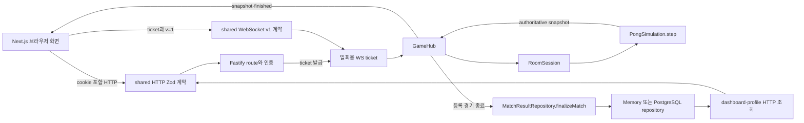
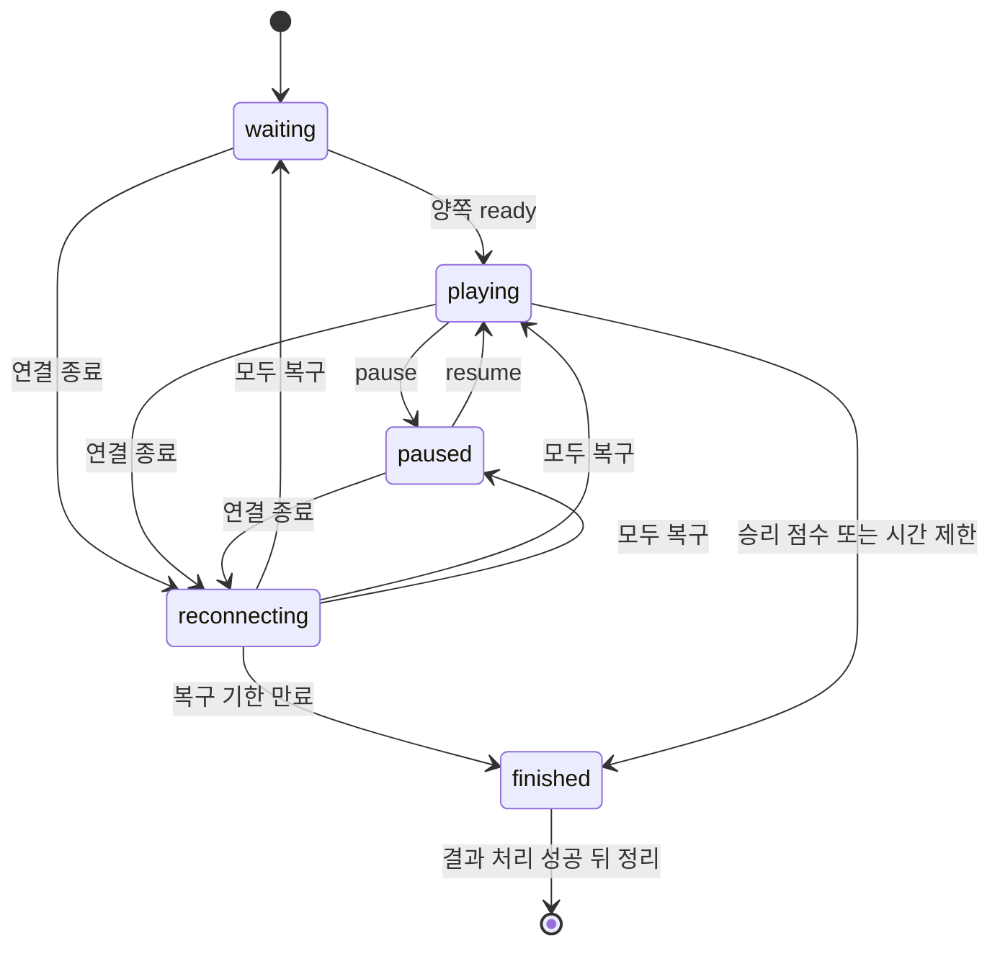

# 서버 구조와 경기 처리 흐름

Pong Pong은 브라우저, Fastify API, PostgreSQL과 실시간 방을 한 사용자 흐름으로
연결하는 프로젝트다. 브라우저는 입력과 표현을 맡고 API 프로세스가 방 상태,
점수와 승패를 판정한다. 실행 중인 연결·대기열·방은 프로세스 메모리에 있고,
등록 경기 결과와 사용자 자료는 `AppRepository`를 통해 저장된다.

## 이 저장소에서 새로 배우는 경계

선행 프로젝트의 다음 문서는 기초 개념을 이미 코드와 연결해 설명한다.

- `container-stack/architecture/runtime-boundaries-and-request-path.md`: 컨테이너,
  서비스 네트워크와 gateway·process 수명
- `web-boundary-inspector/architecture/system-boundary-map.md`,
  `request-trace-lifecycle.md`, `browser-execution-boundary.md`: HTTP reverse
  proxy와 요청 경로, origin, cookie, CORS, 브라우저 event와 비동기 실행
- `portfolio-site/architecture/content-to-deployment.md`,
  `request-rendering-and-hydration-boundary.md`: TypeScript와 runtime validation,
  React·Next.js, hydration과 browser E2E

여기서는 같은 정의를 반복하지 않고 다음 조건을 추가한다.

- workspace package의 source·type·runtime 산출물을 서로 다른 소비자가 읽는다.
- cookie session과 일회용 WebSocket 접속권이 한 사용자 신원을 잇는다.
- HTTP 상태, WebSocket 상태, room 메모리와 PostgreSQL 상태가 서로 다른
  소유자와 수명을 갖는다.
- 하나의 scheduler가 여러 room을 순회하고, PostgreSQL을 선택한 결과만
  transaction으로 영속화한다.
- migration job, readiness와 drain이 container 시작·종료 순서를 결정한다.

## 전체 흐름

`packages/shared`는 값의 모양을 검사하지만 권한을 판단하지 않는다. HTTP
handler가 session·role·status를 확인하고, `GameHub`가 연결·좌석·입력 순서를
확인하며, repository가 DB 제약과 결과 단일 확정을 맡는다. 이 세 검사를
“공유 schema를 통과했다”는 한 문장으로 합치면 안 된다.

## 사용자 흐름을 읽는 위치

아래 상세 표의 사용자 흐름과 시스템 경계 문서는
등록 사용자의 login→cookie→ticket→match→repository→HTTP 재조회와 guest의
login→process-local queue→guest/AI match→2분 결과 수명을 각각 종단으로
추적한다. 등록 흐름에서도 repository 선택을 구분한다. PostgreSQL만 transaction과
재시작 뒤 영속성을 제공하며 Memory 결과는 같은 process 안에서만 다시 읽는다.

현재 browser E2E와 WebSocket smoke는 어느 쪽도 경기 종료부터 결과 재조회까지
한 시나리오로 증명하지 않는다. 상세 흐름의 각 단계에 연결된 GameHub,
repository, smoke와 E2E의 검증 범위를 함께 확인해야 한다.

## 방 상태와 소유권

| 상태·자원 | 소유자 | 수명과 정리 |
| --- | --- | --- |
| HTTP query cache | 브라우저 `QueryClient` | page tree가 유지되는 동안 존재하며 mutation·401에서 선택적으로 무효화한다. |
| WebSocket과 연결 세대 | `GameSocketClient`, `GameHub` | 새 연결이 이전 연결을 교체하고 close에서 timer·listener·lease를 정리한다. |
| queue·reservation | `Matchmaker`와 `GameHub` | 매칭·취소·disconnect·drain에서 해제해야 한다. |
| room·input gate·scheduler callback | API 프로세스 | 종료 성공이나 강제 close까지 남으며 다른 프로세스로 이전하지 않는다. |
| session·사용자·경기 결과 | 선택한 repository | Memory는 프로세스 수명이다. PostgreSQL session은 조회 때 만료를 거절하지만 만료 행 cleanup은 없고, 사용자·결과는 DB 삭제·migration 수명을 따른다. |
| migration 상태 | PostgreSQL과 Kysely migration table | application 시작과 분리되며 readiness는 migration 이름 집합을 비교한다. |

## 상세 문서

| 주제 | 확인할 내용 |
| --- | --- |
| [사용자 흐름과 시스템 경계](../architecture/user-journeys-and-system-map.md) | 화면별 상태, 등록 사용자·게스트 종단 흐름, HTTP·실시간·영속 상태 |
| [인증에서 실시간 연결까지](../architecture/authentication-and-realtime-connection.md) | Fastify 요청 수명, cookie, ticket, CSRF·Origin, 계정 상태 |
| [매칭, 방, 재접속의 수명](../architecture/matchmaking-room-and-recovery-lifecycle.md) | queue, reservation, simulation, scheduler, reconnect와 drain |
| [입력, 스냅샷, 브라우저 상태의 경계](../architecture/snapshot-backpressure-and-client-state.md) | 입력 순번, backpressure, interpolation, stale callback |
| [경기 결과 확정과 데이터 일관성](../architecture/result-finalization-and-data-integrity.md) | schema 관계, result key, transaction, repository 차이 |
| [게스트 데모의 격리와 자원 상한](../architecture/guest-isolation-and-resource-limits.md) | 서명 cookie, process-local ticket·lease·result |
| [배포, 관측, 정상 종료의 경계](../architecture/operations-deployment-and-fault-evidence.md) | build/runtime mode, Compose, readiness, metrics와 종료 |

## 현재 보장 범위

다음은 현재 코드와 테스트가 나눠 보장하는 범위다.

- 브라우저가 점수나 승자를 보내지 않고 서버 simulation이 판정한다.
- 같은 `resultKey`의 등록 경기 결과는 repository에서 한 번만 반영한다.
- 한 사용자의 새 socket이 이전 socket을 교체하며 좌석은 제한된 시간 동안
  복구할 수 있다.
- PostgreSQL 결과 확정은 match, rating history와 tournament 진행을 필요한
  row lock과 transaction 안에서 처리한다.
- Compose는 migration 성공과 API readiness 뒤에 web과 공개 진입점을 연다.

다음은 보장하지 않는다.

- 실행 중인 방의 프로세스 간 이전과 재시작 복구
- HTTP CSRF token과 WebSocket `Origin` allowlist
- logout 후 열린 socket 즉시 폐기(ban은 GameHub runtime revoke 적용)
- 한 room callback 예외의 scheduler 격리
- 같은 result key에 다른 참가자·점수를 보낸 재시도의 불일치 검출
- 결과 저장 실패 뒤 finished room의 자동 재처리
- `game.finished` 뒤 늦은 snapshot으로부터 종료 UI를 완전히 보호하는 reducer
- 저장된 부하·장애 결과를 다른 환경과 현재 실행에 그대로 적용하는 것
