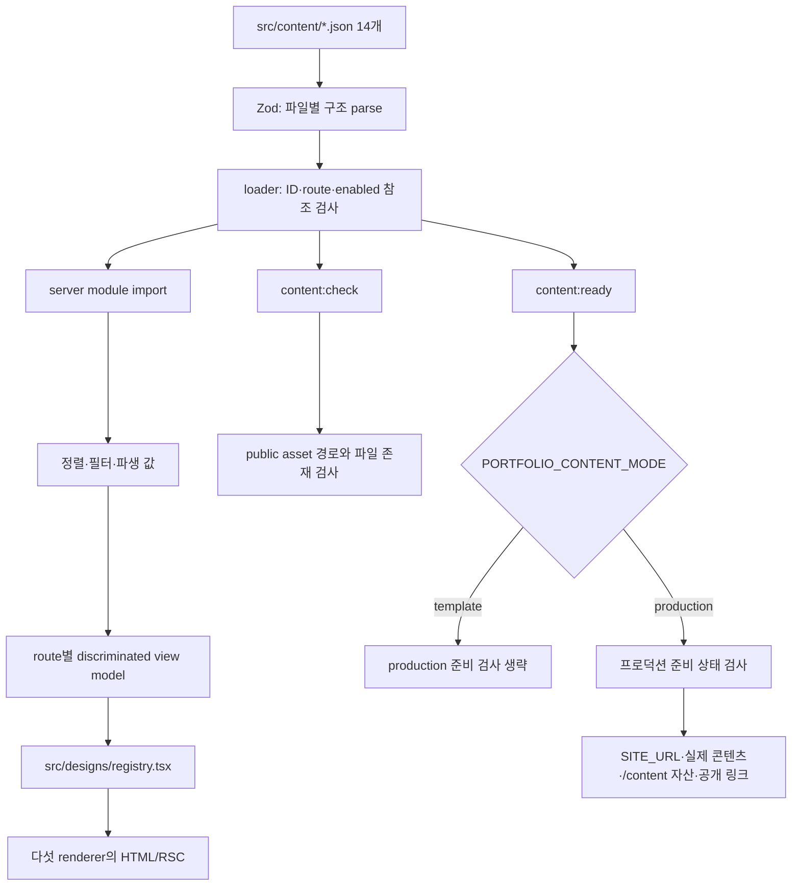

# 콘텐츠 편집과 실패 복구 절차

프로필이나 프로젝트를 한 디자인 파일에 직접 넣으면 같은 내용을 다섯 번
수정해야 한다. 이 프로젝트는 `src/content`의 JSON을 원본으로 두고, runtime
검증과 route view model을 거친 뒤 다섯 renderer가 공유한다. 이 문서는 콘텐츠를
바꿀 때 어느 파일을 수정하고 어느 실패를 어디서 진단하는지 설명한다. 타입과
객체 수명은 [콘텐츠 architecture](../architecture/content-to-deployment.md)에
정리되어 있다.



`prebuild`는 `content:check`와 `content:ready`를 차례로 실행한다. 이 두 branch는
build를 막는 gate이지 page request가 매번 거치는 renderer 파이프라인이 아니다.
특히 `content:ready`는 repository asset의 실제 존재를 검사하지 않으므로
`content:check`를 대신하지 않는다. page/layout과 metadata route는 같은 mode를
별도로 읽어 template이면 noindex 정책을 선택한다.

## 1. 수정할 원본 찾기

| 원본 | 소유하는 내용 | 주요 참조 |
| --- | --- | --- |
| `site.json` | title, description, language, brand, page 활성 상태, navigation, footer, optional social image | layout, metadata, shell, sitemap |
| `profile.json` | 이름, 역할, 소개, 위치, availability, optional photo, principles | 모든 home/shell, structured data |
| `projects.json` | group, metric, project 본문, 배포 상태, image, stack ID, project link | 목록·상세·home·resume·journey |
| `presentation.json` | 다섯 디자인 목록, UI accessible name, section 순서, route별 화면 문구 | 다섯 renderer |
| `skills.json`, `tech-stack.json`, `experience.json` | 기술·경험 표시와 참조 ID | home/about/detail |
| `journey.json`, `journey-narrative.json` | timeline과 milestone, optional project 참조 | home/journey |
| `interview-map.json`, `curation.json` | 질문/답변·분류와 project 참조 | interview-map/about |
| `links.json`, `contact.json` | 전역 link와 연락 문구 | hero/contact/footer |
| `resume.json` | optional PDF, 요약, project ID, 교육·훈련 | resume |

화면의 모든 문자열이 JSON에 있는 것은 아니다. 예를 들어
`src/app/not-found.tsx`의 404 제목과 홈 링크는 애플리케이션 고정 문구이므로
schema와 production placeholder 검사 대상이 아니다.

프로젝트 group 설명에는 이중 입력처럼 보이는 부분이 있다.
`presentation.pages.projects.groups`는 schema가 요구하지만
`src/lib/portfolio/content.ts`가 실행 중 `projects.groups`의 label과
description으로 다시 만든 값으로 덮어쓴다. 실제 목록의 group 문구를 바꿀 때는
`projects.json`을 수정한다.

## 2. TypeScript와 Zod가 확인하는 범위 구분하기

JSON을 import했다고 TypeScript가 파일 내용을 신뢰할 근거는 생기지 않는다.
TypeScript는 component props, route parameter, selector 반환값과 view model
union처럼 소스 사이의 정적 계약을 검사한다. 실행 중 읽은 문자열이 진짜 URL인지,
project ID가 실제 항목을 가리키는지는 확인하지 않는다.

`src/lib/content-schema.ts`의 Zod schema는 JSON 값을 runtime에 parse한다.
project와 presentation 일부 타입은 `z.infer`로 schema에서 파생되지만
`SiteContent`, `ProfileContent`, `ContentLink`, `PortfolioProject` 등은
`src/lib/portfolio/types.ts`에 수기로 선언되어 있다. `content.ts`에도
`as`와 `as unknown as PresentationContent`가 남아 있다. schema와 수기 타입을
한쪽만 바꾸면 parse는 통과해도 TypeScript 의미가 어긋나거나 단언이 오류를
가릴 수 있다.

새 필드를 추가할 때는 다음 생산자와 소비자를 한 묶음으로 확인한다.

1. JSON 원본과 `content-schema.ts`
2. 필요한 경우 `portfolio/types.ts`
3. `content-loader.ts`의 교차 참조
4. `portfolio/content.ts`의 정규화
5. route view model과 다섯 renderer
6. schema·view model·renderer test

## 3. 구조 오류와 관계 오류 구분하기

`npm run content:check`는 `scripts/validate-content.ts`를 실행한다. 먼저 파일별
Zod parse를 수행하고, 모든 파일의 구조가 맞으면 다음 관계를 검사한다.

- project group ID/order, project metric ID, project ID/order
- technology/link/milestone/interview track/curation category/design ID 중복
- navigation href와 각 project의 tag/stack reference 중복
- project가 가리키는 group과 stack ID
- resume, journey, narrative, interview map, curation이 가리키는 project
- contact가 가리키는 link
- navigation과 내부 link가 지원하고 활성화된 route/project를 가리키는지
- default design과 지원하는 다섯 design이 일치하는지
- JSON이 가리키는 public asset이 실제 파일로 존재하는지

구조 오류에는 파일과 JSON path가 붙는다. 정상적으로 route를 해석한 뒤 발견한
교차 참조 오류도 가능한 문제를 모아서 보고한 뒤 `PortfolioContentError`를
던진다. 실패한 상태의 일부 콘텐츠를 화면에 반환하지 않는다.
`portfolioSource = loadPortfolioSource()`가 module load 때 실행되므로 검증
실패는 checker뿐 아니라 해당 server module을 적재하는 build나 실행도 중단시킬
수 있다.

한 가지 예외가 있다. `contentHrefSchema`는 `/projects/%`처럼 잘못된 percent
encoding이 든 root-relative 문자열도 허용한다. 이 값은 내부 project route를
검사할 때 예외 처리되지 않은 `decodeURIComponent()`에서 raw `URIError`를
발생시킨다. 이 경우에는 파일·JSON path를 가진 issue로 변환되거나 다른 관계
오류와 함께 수집되지 않는다.

### enabled 상태를 바꿀 때

`enabled: false`인 project와 link는 `getPortfolioContent()` 결과에서 제외된다.
page 활성 상태는 navigation, route의 `notFound()`, sitemap에도 영향을 준다.
비활성 project를 resume나 내부 link가 계속 참조하면 “화면에서만 숨긴 값”이
아니라 끊어진 관계가 되므로 loader가 거부한다.

ID를 바꿀 때 문자열 검색만으로 끝내지 않는다. resume, journey, narrative,
interview map, curation과 project link를 모두 같은 관계로 본다. loader가
검사하는 위치와 view model이 실제로 연결하는 위치를 함께 확인한다.

## 4. URL·날짜·선택 값의 실제 검증 한계

검사가 존재한다는 사실과 그 검사가 완전하다는 주장을 구분해야 한다.

| 입력 | 현재 검사 | 남는 실패 |
| --- | --- | --- |
| 일반 content href | `/`, `#`, `http(s):`, `mailto:`, `tel:` 접두사 | `https://`처럼 `URL` 객체로 parse할 수 없는 문자열도 접두사만 맞으면 통과할 수 있다. |
| 내부 project route | pathname에서 project ID를 찾은 뒤 `decodeURIComponent()` | 잘못된 percent encoding은 `PortfolioContentError`가 아니라 raw `URIError`로 중단될 수 있다. |
| `SITE_URL` | absolute `http(s)`, localhost·loopback·예약 예시 domain·인증 정보 거부 | 사설망 host, DNS/HTTP 도달성, origin 뒤 path/query/hash는 완전히 제한하지 않는다. |
| project/contact 공개 URL | `URL` parse와 `http(s)`, placeholder·예약 domain 검사 | localhost·사설 IP·존재하지 않는 host가 통과할 수 있다. |
| `external` | optional boolean | scheme과 flag의 일관성을 검사하지 않으며 디자인별 새 창 정책도 다르다. |
| image/PDF path | `/template/` 또는 `/content/`, `public/` 파일 존재 | MIME, decode 가능 여부, image 크기, PDF 유효성은 확인하지 않는다. |
| journey date | non-empty string | 날짜 형식과 달력 유효성을 검사하지 않는다. 정렬은 문자열 비교이고 표시는 일부 문자열 slice다. |
| terminal commands | command 문자열과 output 항목의 모양 | 배열 자체의 최소 길이가 없어 빈 배열이 parse된 뒤 Classic runtime에서 실패할 수 있다. |

따라서 새 URL은 브라우저에서 실제 목적지와 새 창 동작을 확인하고, 날짜는 저장소가
사용하는 정렬 가능한 형식을 유지하며, terminal에는 command를 한 개 이상 둔다.

## 5. asset 추가하기

JSON에는 module import가 아니라 public root 기준 URL을 적는다.

```json
{
  "src": "/template/profile/portrait-placeholder.svg",
  "alt": "인물 사진을 대체하는 템플릿 이미지"
}
```

- 예제 단계의 asset은 `public/template/` 아래에 둔다.
- 공개할 asset은 `public/content/` 아래에 둔다.
- `import portrait from "./portrait.png"`처럼 bundler가 추적하는 import asset과
  달리 public asset은 URL 문자열과 실제 파일을 따로 맞춰야 한다.
- `validatePortfolioAssets()`는 `public` 밖으로 벗어난 정규화 경로와 존재하지
  않는 파일을 거부하지만 형식이나 이미지 내용을 읽지 않는다.

Design·Classic의 공통 image component는 raw ``를 사용한다.
Editorial·Brutalist·Cinematic은 `next/image`의 width/height 또는
`fill`·`sizes`를 사용한다. 같은 원본이라도 디자인에 따라 responsive image와
최적화 경로가 다르므로 한 화면에서 보였다는 사실만으로 다섯 디자인을 확인한
것은 아니다.

## 6. template 상태에서 편집하기

기본값은 `PORTFOLIO_CONTENT_MODE=template`이다. 변수 미설정과 빈 문자열도
template로 해석한다. 이 모드는 예제 이름, `/template/` asset, 공개 URL 부재를
허용한다. 대신 root robots metadata는 `noindex`, `/robots.txt`는 전체
disallow, sitemap은 빈 배열이며 JSON-LD는 출력하지 않는다.

일반적인 편집 순서는 다음과 같다.

```sh
npm run content:check
npm run content:ready
```

첫 명령은 모드와 무관한 구조·관계·asset 존재를 확인한다. 둘째 명령은 현재
환경의 mode에 맞는 공개 준비 상태를 확인한다. 저장된 결과로 현재 checkout의
통과를 대신하지 말고 콘텐츠 변경 뒤 두 명령을 다시 실행한다.

## 7. production 입력으로 전환하기

공개 후보를 만들 때는 build와 server가 같은 값을 읽도록 두 변수를 명시한다.

```sh
export PORTFOLIO_CONTENT_MODE=production
export SITE_URL="https://portfolio.example.invalid"
npm run content:ready
npm run build
```

위 `SITE_URL`은 형식을 보여 주는 예시일 뿐 실제 production 값으로 쓸 수 없다.
예약 domain이므로 readiness가 거부한다. 제어하는 실제 public origin으로
바꿔야 한다.

production readiness는 다음을 모아서 실패시킨다.

- placeholder marker가 남은 모든 콘텐츠 문자열
- 실제 public `SITE_URL` 부재
- social image, profile photo, resume PDF 부재 또는 `/content/` 밖 경로
- 활성 project image의 `/content/` 밖 경로
- 활성 project 부재 또는 사용할 수 있는 공개 URL 부재
- contact placement의 email/github/website 방법 부재

placeholder 검사는 heuristic이다. 실제 문장에 들어간 `starter`도 거부할 수
있고 목록에 없는 예제 표현은 놓칠 수 있다. readiness 통과는 콘텐츠가 사실에
맞거나 공개에 적합하다는 검수 결과가 아니다.

starter의 project ID와 site brand를 실제 값으로 바꾸면 콘텐츠 검증과 별도로
일부 unit-test 기준값도 함께 바뀌어야 한다. project URL을 고정한
`performance-gates.test.ts`와 metadata title을 고정한 `site-metadata.test.ts`의
결합 조건은 [개발 문서의 콘텐츠 수정 절차](./development.md)에서 확인한다.

## 8. 화면까지 전달됐는지 확인하기

`getPortfolioContent()`는 비활성 project/link를 제거하고 group과 journey를
정렬한다. `create*ViewModel()`은 route에 필요한 관계를 연결한다.

예를 들어 project detail은 다음 값만 renderer에 전달한다.

```ts
// 현재 타입을 설명하기 위한 축약
type ProjectDetailViewModel = {
  route: "project-detail";
  project: PortfolioProject;
  detailLinks: ContentLink[];
  stackItems: TechStackItem[];
  supportingImages: ProjectImage[];
  // site, profile, presentation, footerLinks
};
```

renderer 안에서 project ID로 원본 배열을 다시 찾기 시작했다면 계산 책임이
view model 밖으로 새어 나온 신호다. 반대로 view model을 최소화할 때 화면에
필요한 contact가 빠질 위험을 consumer 검토에서 확인했으므로 “필드가 적다” 자체가 완료 기준은
아니다. route view model test와 다섯 renderer 행렬에서 결과를 함께 확인한다.

`?debug=content`를 붙이면 화면 근처의 `ContentHint`가 수정할 JSON 경로를
표시한다. 이 query는 authoring 보조 수단이지 schema 검증이나 source map이
아니다. 고정 404 문구, 모든 전용 renderer의 모든 문자열까지 표시한다고
가정하지 않는다.

## 실패 위치별 진단

| 증상 | 먼저 볼 경계 | 남는 상태 |
| --- | --- | --- |
| Zod parse 오류 | 오류의 파일과 JSON path | 콘텐츠 module이 적재되지 않아 화면 생성 전 실패한다. |
| unknown/disabled ID | `content-loader.ts` 교차 참조 | 부분 view model은 만들어지지 않는다. |
| asset not found | JSON URL과 `public/` 실제 경로 | path 문자열은 남아도 build/checker가 중단된다. |
| production placeholder | `content-readiness.ts` issue 목록 | template mode에서는 같은 값이 허용된다. |
| 한 디자인에서만 내용 누락 | route view model과 해당 renderer | canonical 콘텐츠가 맞아도 표현 소비가 빠질 수 있다. |
| 모든 디자인에서 같은 파생 값 오류 | `content.ts`, selector, view model | 원본보다 공통 변환 경계가 원인일 가능성이 높다. |
| Docker에서만 image 404 | runner의 `public/` 포함과 `test:container` | tracked asset의 HTTP·MIME 검사가 실패한다. |
