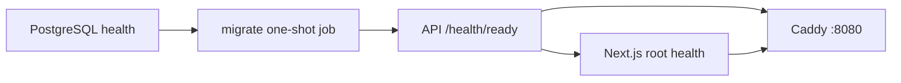
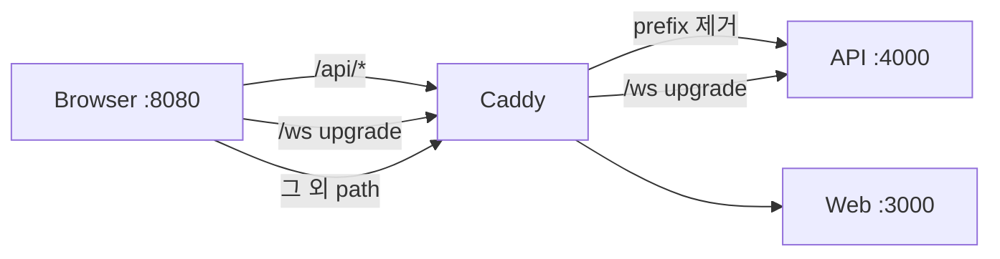
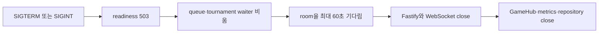

# 운영 준비와 장애 확인

Compose는 PostgreSQL, 일회성 migration, API, web과 Caddy를 한 host에서
연결합니다. registry, 외부 DB, DNS·TLS, secret 배포, 운영 로그인 공급자와
다중 API instance는 이 저장소가 제공하지 않습니다.

## build-time과 runtime 설정

| 설정 | 결정 시점 | 실패할 때 보이는 현상 |
| --- | --- | --- |
| API `APP_MODE` | process 시작 | dev/guest/admin route와 cookie 정책이 달라진다. |
| `API_PORT` | process 시작 | 없으면 4000. 숫자가 아닌 값은 별도 schema 없이 `Number` 변환 뒤 listen 실패로 이어질 수 있다. |
| `DATABASE_URL` | process 시작 | production은 누락 시 시작을 거절한다. development·test·demo는 없으면 Memory를 쓴다. |
| `SESSION_SECRET` | process 시작 | demo/production에서 UTF-8 32바이트 미만이면 시작을 거절한다. |
| `WEB_ORIGIN`, `TRUST_PROXY` | process 시작 | CORS origin과 client IP 해석이 달라진다. |
| `NEXT_PUBLIC_API_BASE_URL`, `NEXT_PUBLIC_WS_URL`, `NEXT_PUBLIC_APP_MODE` | web image build | browser URL·화면·middleware가 이전 환경값을 계속 쓸 수 있다. |

같은 API JavaScript 산출물은 runtime env를 바꿔 재사용할 수 있습니다. web의
public 값은 bundle과 middleware에 들어가므로 mode나 공개 origin을 바꿀 때
다시 build해야 합니다. 이전 web image를 설정만 바꿔 재사용하는 것은 지원되는
전환 방식이 아닙니다.

`APP_MODE`를 생략하면 `NODE_ENV=production`은 production,
`NODE_ENV=test`는 test, 그 밖의 값은 development를 선택합니다. Compose는
`APP_MODE`를 명시적으로 전달하므로 이 fallback은 API를 직접 실행하거나
test가 환경을 조립할 때 주로 나타납니다.

Demo의 repository 선택과 인증 선택은 별개입니다. `DATABASE_URL`을 줘도 HTTP는
registered session cookie를 무시하고 guest cookie만 사용하며, WebSocket도
PostgreSQL ticket을 소비하지 않습니다. DB가 ready라는 사실로 등록 사용자 기능이
열렸다고 판단하면 안 됩니다.

`SESSION_SECRET`은 demo에서 guest cookie HMAC에 사용됩니다. Production도
길이 검사를 통과해야 하지만 guest 경로가 열리지 않아 이 값으로 registered
session cookie를 서명하지 않습니다. Registered session은 DB의 임의 token을
조회하며, production에는 그 session을 새로 발급할 로그인 공급자도 없습니다.

## Compose 시작 순서

1. PostgreSQL의 `pg_isready`가 통과합니다.
2. `migrate`가 API image의 `packages/db/dist/cli.js migrate`를 실행하고 0으로
   종료합니다.
3. API가 시작되고 `/health/ready` healthcheck를 통과합니다.
4. web이 build된 standalone server를 시작하고 root HTTP healthcheck를
   통과합니다.
5. Caddy가 API와 web이 healthy인 뒤 8080을 공개합니다.

`depends_on`은 시작 시점의 순서를 정할 뿐 이후 API가 unhealthy가 됐을 때
Caddy route를 자동으로 닫지 않습니다. web health는 root 응답만 확인하므로
API, cookie, WebSocket과 실제 사용자 흐름을 증명하지 않습니다. Caddy 자체의
healthcheck와 이 Compose 안의 TLS termination도 없습니다.

API와 web container는 image build에서 만든 `dist`와 Next.js standalone을
실행하고 root 사용자를 쓰지 않습니다. application container가 시작할 때
dependency 설치, build, migration, seed를 다시 수행하지 않습니다.

`migrate`는 schema만 준비합니다. development의 예시 사용자·관리자·DB NPC는
`seed:dev`로 따로 만들어야 합니다. seed 누락은 API readiness가 탐지하지
않습니다.

## PostgreSQL volume의 수명

Compose의 논리 volume `pong-pong-db`를 PostgreSQL의
`/var/lib/postgresql/data`에 mount합니다. Container와 DB process는 교체돼도
named volume은 Docker daemon이 별도 소유하므로
`docker compose down --remove-orphans`만으로는 삭제되지 않습니다. 다음
`up`에서 migration·사용자·session·smoke/E2E가 만든 row를 다시 볼 수 있습니다.

`docker compose down -v`나 별도 volume 삭제는 이 영속 데이터를 제거하는
파괴적 초기화입니다. 폐기 가능한 개발 DB인지, 보존·백업할 데이터가 없는지
확인한 뒤에만 사용해야 합니다. Browser cookie나 test context를 지우는 것은
이 volume을 초기화하지 않습니다.

## 공개 request 경로

- `/api/metrics`는 정확히 404로 막습니다.
- `/api/*`는 `/api`를 제거한 path로 API에 전달합니다.
- `/ws`는 upgrade header를 유지해 API로 전달합니다.
- 그 밖의 path는 Next.js web으로 보냅니다.

Compose의 `"8080:8080"`은 host IP를 생략하므로 Caddy의 8080을 모든 host
interface에 게시합니다. `http://localhost:8080`은 기본 client URL이지
loopback으로 노출을 제한하는 설정이 아니며, 실제 원격 도달성은 host
firewall과 routing에도 달려 있습니다.

이 배치에서는 page, API와 WebSocket이 같은 origin을 사용하므로 browser의
일반 CORS 교차-origin 허용이 필요하지 않습니다. `localhost:3000`의 개발 web이
`localhost:4000` API를 직접 부를 때는 origin이 달라 API CORS 설정이
개입합니다. CORS는 WebSocket `Origin` 검사를 대신하지 않으며 API의 `/ws`에는
별도 allowlist가 없습니다.

원격 host 이름이나 IP를 공개 주소로 쓸 때는 `PUBLIC_ORIGIN`과
`PUBLIC_WS_URL`을 같은 공개 host의 HTTP·WebSocket 주소로 맞추고 web image를
다시 build해야 합니다. `PUBLIC_ORIGIN`은 API의 `WEB_ORIGIN`에도 전달됩니다.
기본값으로 build한 web을 원격 browser에서 열면 bundle의 `localhost`는 server가
아니라 그 browser가 실행되는 host를 가리킵니다.

cookie는 domain 속성을 따로 지정하지 않는 host-only이고 path는 `/`입니다.
실제 HTTPS 배포에서는 public HTTP URL과 WebSocket URL을 `https`·`wss`로 함께
맞추고 proxy가 원래 client IP·scheme을 한 hop으로 전달한다는
`TRUST_PROXY=1` 전제를 확인해야 합니다.

## liveness와 readiness

| 경로 | 확인하는 범위 | 확인하지 않는 것 |
| --- | --- | --- |
| `/health/live` | Node HTTP process가 응답하는지 | DB, migration, room, downstream |
| `/health/ready` | accepting/draining, repository query, migration 이름 집합 | seed, 실제 column shape, 운영 인증, WebSocket 성공 |
| `/metrics` | HTTP·repository·connection·queue·room·snapshot·finalization·event loop 관측값 | 복구 실행, DB 업무 상태의 source of truth |

PostgreSQL readiness는 DB query와 expected/applied migration 이름 집합을
비교합니다. 같은 이름의 SQL checksum이나 실제 table·column·constraint가
현재 파일과 같은지는 확인하지 않습니다. `IF NOT EXISTS`가 불완전한 예전
table을 건너뛰어도 이름만 맞으면 `current`일 수 있습니다.

Memory repository는 development·test·demo에서 `database:up`,
`migrations:not_applicable`이므로 ready 응답만 보고 영속 저장이 준비됐다고 판단하면
안 됩니다. production은 `DATABASE_URL`이 없으면 readiness 전 시작 단계에서 실패합니다. readiness는 migration
job이 실제로 이 process 시작 전에 실행됐다는 역사도 보관하지 않습니다.

준비 응답에는 접속 문자열, SQL과 내부 exception을 넣지 않습니다. `/metrics`는
Prometheus text라 shared JSON output parser의 대상이 아니며 API 직접 포트에는
별도 인증이 없습니다.

## metrics와 로그 해석

HTTP 로그는 request ID를 부여하고 cookie, Authorization, query string과
WebSocket ticket을 가립니다. API 내부의 user·room·match ID를 같은 시간대에
대조할 수 있지만 distributed trace나 browser까지 이어지는 trace context는
없습니다.

다음 지표 이름은 물리 저장소를 그대로 뜻하지 않을 수 있습니다.

- registered 결과의 finalization label은 Memory repository에서도
  `persistence="database"`로 기록됩니다.
- `database_operation` histogram도 instrumented Memory repository 호출을
  포함합니다.
- online, playing, queued와 active room은 현재 `GameHub`의 관측값이며 DB 행
  수가 아닙니다.
- snapshot delivery는 server send callback까지의 시간이지 browser paint
  완료 시간이 아닙니다.

Prometheus counter는 process 시작 뒤 누적됩니다. 같은 API process에 여러
부하 실행을 붙이면 시작값을 빼지 않는 한 이전 실행의 연결·결과가 섞입니다.
지표는 장애를 찾는 단서이며 match, session, tournament의 최종 상태를 고치는
제어 입력이 아닙니다.

## 정상 종료

`SIGTERM`이나 `SIGINT` 첫 신호가 다음 절차를 한 번 시작합니다.

`api` service는 `stop_grace_period: 70s`를 제공하므로 Compose가 application의
최대 60초 room drain과 뒤이은 `app.close()`·repository close를 기다릴 여유를
둡니다. Host나 orchestrator가 이보다 짧게 강제 종료하면 이 보장은 적용되지
않습니다.

drain은 새 `queue.join`과 tournament match 참가를 `server_draining`으로
거절합니다. 대기 reservation도 해제합니다. 하지만 새 HTTP write 전체와 새
WebSocket handshake를 즉시 막지는 않습니다. “종료 시작 뒤 모든 새 요청을
거절한다”는 설명은 현재 코드보다 강합니다.

playing room은 정상 종료를 기다릴 수 있지만 waiting, paused, reconnecting도
활성 room으로 남습니다. 60초 안에 끝나지 않아도 drain 결과와 관계없이
`app.close()`가 실행되고 남은 socket·room을 닫습니다. 이때 진행 중 room을
다른 instance로 넘기지는 않습니다. 결과 저장의 일시 실패는 같은 process 안에서
동일 result key로 capped-backoff 재시도하지만, durable outbox나 재시작 복구는
제공하지 않습니다.

Fastify close hook은 `GameHub`의 heartbeat·snapshot buffer·scheduler와 metrics를
닫고 repository의 Kysely/pg pool을 닫습니다. guest access의 만료 timer는
`unref` 상태라 process를 붙잡지는 않지만 별도 `close()`로 즉시 비우는 경계는
없습니다.

## 저장된 부하·장애 증거

실행 방법은 [부하·장애 주입 안내](../tests/load/guide.ko.md), 원본 결과는 다음
파일에 둡니다.

- [기준 부하 결과](./measurements/load-2026-07-24.json)
- [장애 복구 결과](./measurements/fault-recovery-2026-07-24.json)
- [스케줄러 비교 결과](./measurements/scheduler-2026-07-24.json)

기준 부하의 필수 두 실행은 reconnect 성공률 96%, 95%로 99% 기준을
충족하지 못했고 `requiredProfilePassed`도 `false`입니다. snapshot과
finalization 지표 일부가 기준 안에 들었다고 전체 통과로 바꾸지 않습니다.

장애 결과는 로컬 Compose와 Toxiproxy에서 DB·edge latency/down/reset 뒤
readiness와 proxy 응답이 돌아온 것을 기록합니다. 진행 중인 room, browser,
transaction 중간 상태, result event와 다중 instance 장애 복구는 확인하지
않았습니다. scheduler 결과도 합성 timer microbenchmark이므로 실제
`GameHub` 공정성·throughput 근거가 아닙니다.

## 장애를 좁히는 순서

1. `/health/live` 실패는 process, listener와 종료 로그부터 확인합니다.
2. live는 정상이고 `/health/ready`만 실패하면 lifecycle, DB query와 migration
   이름 집합을 나눠 확인합니다.
3. page는 보이지만 API가 실패하면 web build의 API base와 Caddy `/api` prefix
   제거를 대조합니다.
4. HTTP는 정상이고 WebSocket만 실패하면 public `ws`/`wss` URL, upgrade,
   ticket 소비, version과 `Origin` 정책 부재를 구분합니다.
5. room이 멈추면 room phase, shared scheduler 등록, callback exception과
   event-loop 지연을 함께 확인합니다.
6. 결과가 없으면 `GameHub`의 finished 상태, process-local retry timer와 repository
   transaction을 나눠 확인합니다. 일시 실패는 capped backoff로 재시도하지만
   process 재시작을 넘는 durable outbox는 없습니다.
7. Toxiproxy 실험 뒤에는 성공·실패와 관계없이 proxy reset과 API readiness
   회복을 확인합니다.
