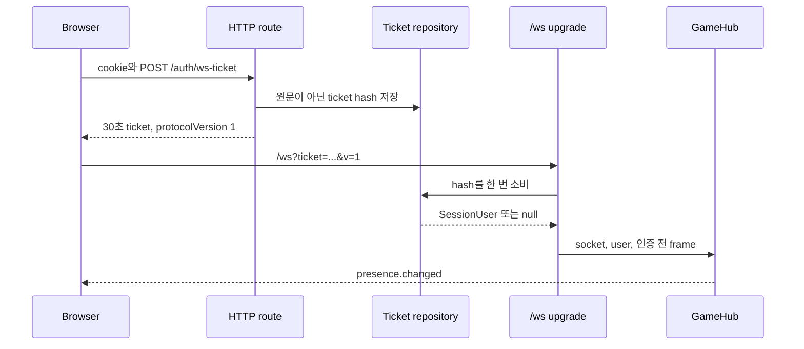
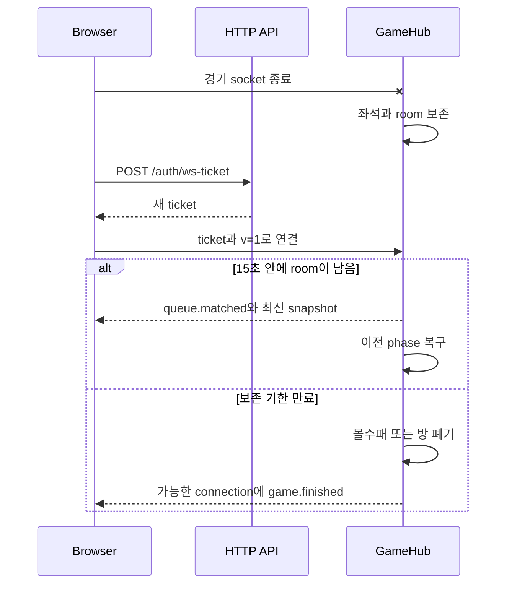

# HTTP와 실시간 프로토콜

공개 JSON의 기준은 `packages/shared/src/http.ts`, `ws.ts`, `game.ts`의 Zod
schema다. TypeScript 타입은 schema에서 파생하지만 네트워크 값은 수신·송신
시점에 다시 검사한다. 공유 package는 값의 형태만 소유하고 session, role,
room 좌석과 DB transaction은 소유하지 않는다.

## HTTP 요청 수명

JSON route의 실제 순서는 다음과 같다.

1. Fastify의 cookie hook과 built-in content parser가 handler 전에 cookie와
   JSON body를 각각 준비한다.
2. route handler에 들어온 뒤 첫 작업으로 `parseHttpRequest`가 params, query,
   body를 각각 Zod schema로 검사한다.
3. handler가 session·guest·role·status를 확인한다.
4. handler가 repository 또는 `GameHub`에 작업을 위임한다.
5. 반환 직전에 `parseOutput`이 응답 schema를 검사한다.
6. 전역 `onResponse` hook이 route·status·지연 시간을 metrics에 기록한다.

따라서 정의하지 않은 query나 body는 domain/repository 호출 전
`validation_error`가 되지만, Fastify route schema나 `preValidation` hook이
처리하는 것은 아니다. 깨진 JSON이나 지원하지 않는 media type처럼 Fastify가
handler 전에 만든 오류는 `ApiHttpError`가 아니며 현재 전역 error handler에서
500 `internal_error`로 바뀔 수 있다. 이를 400으로 고정하는 직접 테스트는 없다.

params, query, body schema는 `.strict()`라 알 수 없는 입력 필드를 거절한다.
반면 ready health를 제외한 여러 output object schema는 `.strict()`가 아니므로
알 수 없는 출력 필드를 실패로 만들지 않고 제거한다. “입력과 출력이 모두 같은
엄격성”이라고 설명하면 틀리다.

## HTTP endpoint

내부 API route에는 `/api` prefix가 없다. Compose의 Caddy가 공개
`/api/*`에서 prefix를 제거해 API로 전달한다. 아래 path는 Fastify 내부 path다.
모든 JSON route의 query는 현재 빈 strict object이며 pagination parameter가
없다.

### 상태·인증

| method·path | mode·인증 | 입력 | 성공 응답 | status와 중복 영향 |
| --- | --- | --- | --- | --- |
| `GET /health` | 전체·공개 | 없음 | `{ok, service}` | 200. 프로세스 응답만 확인한다. |
| `GET /health/live` | 전체·공개 | 없음 | `{status:"ok", service}` | 200. DB·migration은 확인하지 않는다. |
| `GET /health/ready` | 전체·공개 | 없음 | lifecycle, database, migrations check | 준비 200, drain·DB·migration 문제 503 |
| `GET /metrics` | 전체·공개 API 포트 | 없음 | Prometheus text | 200. JSON 계약 예외이며 Caddy의 `/api/metrics`는 404다. |
| `POST /auth/dev-login` | development/test | `handle`, `displayName`, 선택 `email` | `{user}`와 `pp_session` cookie | 200. 같은 handle 재호출은 사용자를 갱신하고 새 session을 만든다. |
| `POST /auth/guest` | demo | 빈 body | `{user, guest:true, expiresInSeconds:7200}`와 `pp_guest` cookie | 200, 생성 제한은 429. 호출마다 새 guest ID다. |
| `POST /auth/logout` | 전체·인증 불필요 | 빈 body | `{ok:true}` | 200. 항상 두 cookie를 지운다. 현재 user가 guest로 해석되면 함께 있던 등록 session row는 남는다. 반복 가능하다. |
| `POST /auth/ws-ticket` | 로그인·active | 빈 body | `{ticket, expiresInSeconds:30, protocolVersion:1}` | 200, guest 상한은 429. 호출마다 별도 일회용 ticket이 생긴다. |
| `GET /me` | 로그인 | 없음 | `{user}` | 200 또는 401. active status를 다시 확인하지 않는다. |
| `GET /auth/me` | 로그인 | 없음 | `{user}` | `/me`와 같은 alias다. |

production에는 새 등록 session을 만드는 endpoint가 없다. 기존 PostgreSQL
session은 조회할 수 있지만 OAuth나 다른 운영 인증 공급자가 포함돼 있지 않다.
Demo는 더 강하게 guest-only다. PostgreSQL을 연결해도 HTTP의 `pp_session`과
WebSocket의 repository ticket을 인증 수단으로 사용하지 않는다.

### 사용자·로비·프로필·친구

| method·path | mode·인증 | 입력 | 성공 응답 | status와 중복 영향 |
| --- | --- | --- | --- | --- |
| `GET /users/:id` | demo 제외·공개 | UUID `id` | `{user}` | 없거나 demo이면 404 |
| `GET /lobby` | 전체·공개 | 없음 | `me`, online players, recent matches, chat, stats | guest/demo는 기록·채팅을 빈 배열로 받는다. |
| `POST /chat/lobby` | 등록·active | `{body}` 1~240자 | `{message}` | 200. 재호출마다 chat row가 생기므로 멱등하지 않다. |
| `GET /leaderboard` | demo 제외·공개 | 없음 | `{entries}` | demo는 404. cursor·offset이 없다. |
| `GET /dashboard` | 등록 로그인 | 없음 | `me`, recent matches, win rate, best streak | banned session도 현재 통과한다. |
| `GET /profile/:handle` | demo 제외·공개 | 1~64자 `handle` | `{user, recentMatches}` | 없거나 demo이면 404 |
| `GET /profile/me` | 등록 로그인 | 없음 | `{profile}` | active status를 다시 확인하지 않는다. |
| `PATCH /profile/me` | 등록 로그인 | `displayName` 또는 `avatarKey` | `{profile}` | 같은 값 반복은 상태상 멱등이나 별도 idempotency key는 없다. |
| `GET /friends` | 등록 로그인 | 없음 | `{friends}` | 목록만 제공하며 browser 화면은 현재 사용하지 않는다. |
| `POST /friends/request` | 등록·active | `{handle}` | `{friend}` | 같은 방향 반복은 기존 관계를 반환하고 역방향 pending 요청은 accepted가 된다. 자기 자신·없는 대상 오류는 현재 500이 될 수 있다. |
| `POST /friends` | 등록·active | `{handle}` | `{friend}` | 위 route와 같은 handler를 쓰는 alias다. |
| `POST /friends/:id/accept` | 등록 로그인 | friendship UUID `id` | `{friend}` | addressee 소유권은 repository가 검사한다. 잘못된 ID·소유권은 500이 될 수 있다. |

최근 경기와 목록은 API query로 조정할 수 없다. PostgreSQL 구현은 최근 경기 8,
lobby chat 20, leaderboard 20처럼 내부 고정 limit을 사용한다. Memory 구현은
일부 limit·정렬을 똑같이 적용하지 않으므로 같은 interface가 같은 자료량까지
보장하지는 않는다. 친구 삭제 route와 match chat 조회 route는 없다.

### 토너먼트·관리

| method·path | mode·인증 | 입력 | 성공 응답 | status와 중복 영향 |
| --- | --- | --- | --- | --- |
| `GET /tournaments` | demo 제외·공개 | 없음 | `{tournaments}` | demo는 404. PostgreSQL 목록은 고정 limit 10이다. |
| `POST /tournaments` | 등록·active | `{name}` 1~80자 | `{tournament}` | 200. 반복하면 새 tournament를 만들므로 멱등하지 않다. |
| `POST /tournaments/:id/join` | 등록·active | tournament UUID `id` | `{tournament}` | 같은 사용자의 반복·동시 요청은 entry를 늘리지 않고 현재 summary를 반환한다. row lock으로 정원·seed를 정하지만 not found/full 등은 500이 될 수 있다. |
| `GET /admin/users` | demo 제외·active admin | 없음 | `{users}` | 401, 403 또는 200. PostgreSQL 고정 limit 50 |
| `GET /admin/actions` | demo 제외·active admin | 없음 | `{actions}` | PostgreSQL 고정 limit 30 |
| `POST /admin/users/:id/ban` | demo 제외·active admin | 선택 `banned`, `reason` | `{user}` | 매 호출이 상태 변경과 audit row를 남길 수 있고 자기 자신도 대상이 될 수 있다. |
| `PATCH /admin/users/:id/status` | demo 제외·active admin | `status`, 선택 `reason` | `{user}` | 위 동작의 명시적 status 형태이며 self-ban 방지는 없다. |

개발 로그인에서 handle을 `admin`으로 정해도 admin role을 얻지 않는다. 오히려
기존 같은 handle을 일반 user role로 갱신한다. 관리자 준비는 DB CLI의
role 변경 경계다.

## HTTP 오류 계약

오류 본문은 RFC 7807이 아니라 프로젝트 전용 envelope다.

```json
{
  "error": {
    "code": "validation_error",
    "message": "입력값을 확인해주세요.",
    "requestId": "req-1",
    "fieldErrors": {
      "displayName": ["값이 너무 깁니다."]
    }
  }
}
```

| status | 현재 대표 code·원인 |
| ---: | --- |
| 400 | `validation_error`: handler의 Zod 입력 검사 실패 |
| 401 | `authentication_required`: session 또는 guest cookie 없음·만료 |
| 403 | `account_suspended`, `admin_required`, `guest_feature_forbidden` |
| 404 | `not_found`: route·사용자·profile 없음, demo에서 숨긴 등록 기능 |
| 429 | guest session·ticket 등 프로세스 메모리 상한 |
| 500 | `internal_error`: 예상하지 않은 repository/domain/parser/output 오류 |
| 503 | readiness가 drain·DB·migration 문제를 발견 |

409 conflict 계약과 HTTP idempotency key는 없다. 결과 단일 확정의
`resultKey`는 HTTP 요청 멱등성이 아니라 서버가 계산한 한 경기 결과의 업무
식별자다. SQL, 접속 문자열과 내부 exception message는 500 body에 넣지 않는다.

Web의 [`responseError`](../apps/web/src/lib/api.ts)는 이 envelope를
`ApiError`로 바꾸며 status, code, message, request ID와 field error를 보존한다.
Body가 JSON이 아니거나 schema와 다르면 code를 `HTTP_ERROR`로 바꾸고 response
header의 request ID 또는 `unknown`을 쓴다. 401은 전역 session-expired event를
추가로 발생시켜 private cache를 비운다. 다만 현재 화면 mutation은 대체로
`code`, `requestId`, `fieldErrors`를 표시하지 않고 고정 안내 문구로 합친다.
Server가 같은 오류 계약을 보낸다는 사실과 사용자가 모든 진단 정보를 본다는
말은 다르다.

## cookie, CSRF와 mode

등록 session은 원문 임의 token인 `pp_session`으로 식별한다. PostgreSQL은
14일 만료 시각을 검사하지만 Memory session에는 별도 만료가 없다. guest
cookie는 사용자·발급 IP·만료 시각이 보이는 payload와 HMAC 서명으로 구성된다.

두 cookie helper는 host-only, `HttpOnly`, `SameSite=Lax`, path `/`를 사용한다.
실제로 guest cookie가 발급되는 demo에서는 `Secure:true`다. Registered
`pp_session` 발급 route는 development/test에만 있고 그 두 mode에서는
`Secure:false`다. Helper는 production/demo에서 secure 값을 만들지만 그
mode에는 registered session 발급 route가 없다. `HttpOnly`는 JavaScript 읽기를
막고 `SameSite=Lax`는 일부 cross-site 전송을 줄이지만 요청별 CSRF token이나
HTTP `Origin` 검사는 없다. CORS는 응답 읽기 정책이며 cookie를 동반한 모든
요청의 부작용을 막는 인가 장치가 아니다.

active 상태 검사는 route마다 다르다. WS ticket, lobby chat, 친구 요청,
tournament 생성·참가와 admin은 active를 요구하지만 `/me`, dashboard·profile,
profile 변경, 친구 목록·수락은 banned session도 통과한다. 이미 발급한 ticket,
열린 socket의 수명도 둘이 다르다. Logout은 미사용 ticket을 취소하지 않는다.
Ban은 ticket row를 미리 지우지는 않지만 consume 시 active 상태 검사가 실패해
그 ticket을 삭제하고 연결을 거절한다. 상태 변경이 성공하면 GameHub가 해당 사용자의
대기열·방 좌석과 이미 인증된 socket도 즉시 폐기한다. Logout은 이미 열린 socket을
즉시 닫지는 않는다.

## WebSocket handshake



등록 ticket은 SHA-256 hash만 repository에 저장하고 atomic delete로 소비한다.
guest ticket은 API 프로세스 `Map`에서 소비한다. guest ticket 발급 때 IP를
기록하지만 소비 함수는 연결 IP를 비교하지 않으며, 연결 시점에는 IP별 lease
상한만 적용한다.

upgrade는 `ticket`과 query version만 검사한다. WebSocket `Origin` allowlist는
없고 HTTP CORS가 대신 적용되지도 않는다. 일회용 ticket은 장기 session 원문
노출과 재사용 범위를 줄이지만 CSWSH의 모든 조건을 해결하지 않는다.

WebSocket transport는 인증 전후 모든 단일 frame을 8KiB로 제한한다. 인증 전에는
그 안에서 최대 16개, 합계 32KiB의 추가 buffer 상한도 적용한다.

| close code | 사용되는 상황 |
| ---: | --- |
| `1008` | 지원하지 않는 version, 잘못되거나 만료된 ticket, guest connection 상한 |
| `1009` | 인증 전 frame 또는 buffer 크기 초과 |
| `1011` | ticket 소비 중 예상하지 못한 서버 오류 |
| `4001` | 같은 사용자의 새 connection이 이전 connection을 교체 |

혼잡과 heartbeat timeout은 `terminate()`를 사용할 수 있어 close frame을 항상
받는다고 보장하지 않는다. 인증 뒤에는 모든 message에 적용하는 별도
애플리케이션 byte·rate 상한이 없고, 게임 입력만 token bucket을 거친다.

경기 `GameSocketClient`는 close code와 reason을 해석하지 않는다. 현재 socket의
모든 `onclose`에서 화면 state가 복구를 요구하면 새 ticket을 발급한다. Local
`client.close()`만 generation을 바꾸고 handler를 떼어 재접속을 막는다. 정상
close frame과 비정상 network 단절의 wire 차이가 browser reconnect 정책을
직접 결정하는 구조는 아니다.

## Client event

모든 frame은 JSON이며 `v: 1`이 필요하다.

| type | 주요 값 | 서버 동작과 권한 |
| --- | --- | --- |
| `queue.join` | `mode: queue \| ai` | 등록·guest queue 또는 즉시 AI 방 요청 |
| `queue.leave` | 없음 | 아직 queued인 entry와 AI timer를 제거한다. 이미 room으로 옮겨진 matched reservation은 room 정리 경로가 해제한다. |
| `tournament.join` | `matchId` | 등록 사용자의 ready tournament match 참가 |
| `game.ready` | `roomId` | 실제 좌석의 ready 상태 갱신 |
| `game.pause` | `roomId` | 실제 좌석이면 진행 중 방을 일시 정지 |
| `game.resume` | `roomId` | 실제 좌석이면 paused 방을 재개 |
| `game.input` | `roomId`, `inputSeq`, `direction` | 좌석·순번·속도 제한을 통과한 paddle 입력 저장 |
| `chat.send` | `scope`, 조건부 `roomId`, `body` | lobby는 `roomId`를 금지하고 match는 UUID room과 실제 좌석 일치를 요구한 뒤 해당 audience에만 저장·방송 |

`inputSeq`는 같은 사용자·room에서 마지막 적용 값보다 커야 한다. 오래된 순번은
token을 소비하기 전에 버리고, 새 입력은 초당 30개·burst 8개의 사용자 단위
token bucket을 거친다.

chat schema는 `scope`와 `roomId`를 discriminated union으로 교차 검사한다.
Lobby 입력은 room ID를 허용하지 않고 match 입력은 UUID room ID를 요구한다.
이 wire 검사는 권한 증명은 아니므로 GameHub가 sender의 실제 좌석과 room을
한 번 더 확인하고, migration 006의 DB CHECK가 저장 계층의 조합도 방어한다.

잘못된 JSON·version·field의 client frame은 `error`의 `invalid_event`를 보내고
연결은 유지한다. message listener는 비동기 repository 작업을 직렬 await하지
않으므로 여러 chat 같은 효과의 완료 순서까지 WebSocket 수신 순서와 같다고
보장하지 않는다.

## Server event와 브라우저 처리

| type | 주요 값 | 의미 |
| --- | --- | --- |
| `queue.matched` | `roomId`, `side`, `opponent` | 방·좌석과 상대 배정 |
| `game.snapshot` | `snapshot.sequence`, tick, phase, 물리 상태 | 서버가 계산한 현재 경기 상태 |
| `game.finished` | result, `persisted`, `matchId` | 종료와 선택한 repository 반영 여부 |
| `chat.message` | message | 저장하거나 중계한 chat |
| `presence.changed` | `online`, `playing` | 현재 hub의 관측값 |
| `error` | code, message | 명령을 적용하지 못한 이유 |

등록 경기 결과 저장은 안정적인 `resultKey`로 단일 in-flight와 capped-backoff 자동 재시도를
수행한다. process가 유지되는 동안 일시 DB 오류에서 복구하고, 성공 뒤 한 번만 방을
정리하고 `game.finished`를 보낸다. `persisted:true`는 선택한 repository의 `finalizeMatch`가 성공했다는
뜻이다. `DATABASE_URL`이 없어 Memory repository를 선택한 실행에서도 true이므로
process 재시작 뒤 남는다는 보장은 아니다. 재시작 뒤 결과의 기준이 되는 것은
PostgreSQL commit과 HTTP 재조회이며, guest는 repository를 건너뛰어
`persisted:false`, `matchId:null`을 받는다.

오류 code는 `invalid_event`, `rate_limited`, `forbidden`, `not_found`,
`server_draining`, `internal_error`다. 내부 exception 문자열은
`internal_error`에 넣지 않는다.

브라우저의 두 socket 경로는 잘못된 server message를 다르게 처리한다.

- `GameSocketClient`는 `parseServerEvent` 실패를 `onFailure`에 넘기지만 socket을
  즉시 닫지는 않는다.
- lobby page의 직접 `WebSocket` handler는 parser exception을 잡지 않아
  controlled error 상태로 바꾸지 못한다.

경기 hook은 `scope: "match"`이고 `roomId`가 현재 방과 같은 메시지만 매치 채팅
reducer에 넣는다. Server도 match 메시지는 sender의 실제 좌석을 확인하고 그 방에만
broadcast한다. Lobby chat은 room ID 없이 전역 lobby audience로 전달되며 경기 UI의
필터를 통과하지 않는다.

입력과 출력의 match room ID는 모두 UUID다. Migration 006은 기존의 잘못된
scope/room 조합을 정리하고 lobby/null, match/UUID 조합을 CHECK constraint로
고정한다. 따라서 parser를 우회한 repository 호출도 같은 불변식을 따라야 한다.

게임 reducer는 마지막 값보다 `sequence`가 작거나 같은 snapshot을 버린다.
그러나 terminal 상태와 `roomId`를 함께 검사하지 않아 `game.finished` 뒤 더 큰
sequence의 늦은 snapshot이 화면을 다시 playing으로 만들 수 있다.

`game.finished.ratingDelta`는 참가자별 실제 DB 변화량이 아니다. 현재 event는
16을 담지만 loser는 일반적으로 -12이고 rating 800 하한에서는 절댓값이 더
작다. PostgreSQL은 참가자별 정확한 값을 `rating_history`에 저장하지만 이를
읽는 repository method나 HTTP route는 없다. Dashboard·profile의 match summary도
승자는 match row의 `rating_delta`, 패자는 고정 -12를 조립하므로 하한에서의
실제 변화량을 복원하지 못한다.

## Heartbeat, backpressure와 reconnect

서버는 15초마다 ping을 보내고 45초 동안 pong이 없으면 connection을 종료한다.
Snapshot은 다음 latest-only 정책을 쓴다.

- `bufferedAmount`가 256KiB를 넘으면 pending snapshot을 최신 한 건으로
  교체한다.
- 1MiB 이상이거나 혼잡이 5초 넘게 지속되면 connection을 종료한다.
- chat, error와 finished event는 snapshot buffer를 거치지 않는다.

전송 callback은 browser가 화면을 그렸다는 ACK가 아니다. pending snapshot과
직접 전송 event의 순서도 하나의 queue로 직렬화하지 않으므로 종료 event 뒤
오래된 snapshot이 전달될 수 있다.

경기 socket이 닫히면 서버는 좌석을 15초 동안 보존한다. 브라우저는 새 ticket과
새 connection으로 복구하며, 초기 `queue.join`을 다시 보내지 않고 서버가
기존 room을 찾아 `queue.matched`와 snapshot을 보낼 것으로 기대한다.



브라우저 reconnect deadline과 횟수는 socket `open` 때 초기화된다. room 복구
event를 확인한 시점이 아니므로 open/close가 반복되면 첫 단절부터 정확히
15초만 재시도한다고 보장하지 못한다. 서버도 두 사용자가 다른 시각에 끊기면
공용 deadline을 뒤 단절 시점으로 다시 잡는다.

## HTTP와 WebSocket을 다시 연결하는 기준

HTTP는 session 생성, 비교적 느린 사용자·목록 자료, ticket 교환과 저장 결과
재조회를 맡는다. WebSocket은 connection 존재, queue, room command, snapshot과
종료 통지를 맡는다. 둘 사이의 연결점은 다음 세 가지뿐이다.

- 같은 사용자 신원을 session → ticket → connection으로 전달한다.
- shared package가 HTTP와 WebSocket wire shape를 함께 제공한다.
- DB 확정 뒤 WebSocket 종료를 알리고, 놓친 결과는 다시 HTTP로 읽는다.

같은 계약 package를 쓴다는 사실이 HTTP cache와 room state를 자동으로
동기화하거나, WebSocket event가 authorization을 대신한다는 뜻은 아니다.
